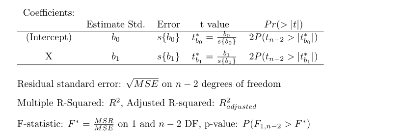
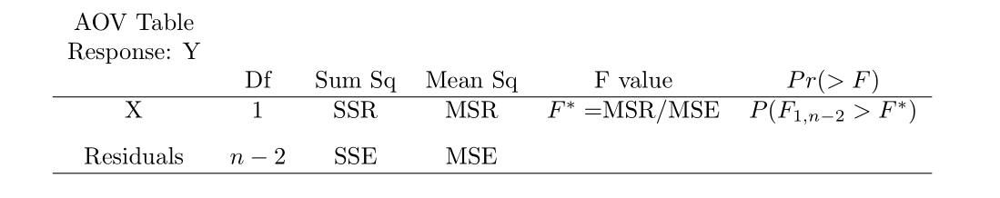
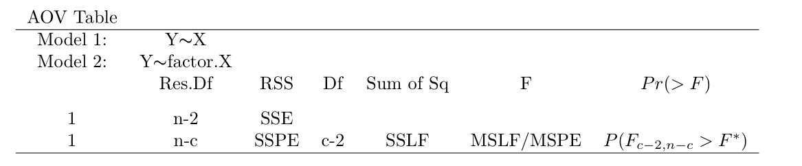
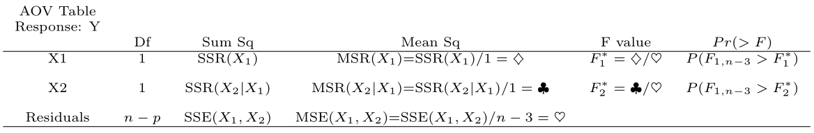
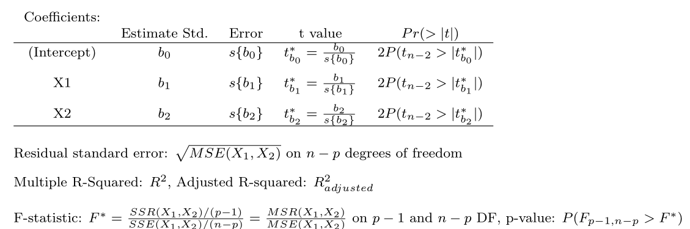
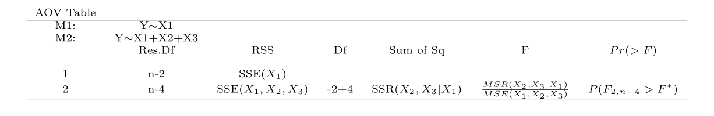

# R code for Design and Analysis of Experiments {#aov}

The goal of this chapter is to have you learn to  use R to
carry out the analyses and techniques covered in Design and Analysis of Experiments
concurrently with learning of the material of the course. 

This chapter uses the examples found
in  Montgomery C.M. \textit{Design and Analysis of
Experiments}, John Wiley and Sons, Inc.


Montgomery C.M., *Design and Analysis of
Experiments*, John Wiley and Sons, Inc.

## Simple Comparative Experiments

This chapter   R will be used to obtain dot and box plots
for the data in the Portland Cement Experiment, as well as perform
various hypothesis test. The researchers are interested in
comparing the strength of the two formulations. Before doing any
analysis we must enter the data into
R.  Enter the data as follows: 

```
> y1 <- c(16.85, 16.40, 17.21, 16.35, 16.52, 17.04, 16.96, 17.15, 16.59, 16.57)
>
> y2 <- c(16.62, 16.75, 17.37, 17.12, 16.98, 16.87, 17.34, 17.02, 17.08, 17.27)
>
> Portland.data=data.frame(y1,y2)
>
> colnames(Portland.data)=c("Modified", "Unmodified") # change the names of the variables
>
> Portland.data
   Modified Unmodified
1     16.85      16.62
...
10    16.57      17.27
```

A new function, `colnames()`, was introduced above which
allows the user to set or change the names of the columns.  We
originally set the variables equal to `y1` and `y2`
which also makes it the default column names in the data frame,
but we can changes the names to using `colnames()`.  Note
that `Portland.data" is a data frame object.


### Dot and Box Plots

Scatterplots can be used to explore the relationship between two variables. Recall that the formula to create a graphical numerical summary follows the general form `goal( ~ x , data)` where `x` is the variable you want to graph. However, now we have an additional variable.  When the data is bivariate the general formula changes a bit: `goal( y ~ x , data )`, where `y` is the name of the response/dependent variable and `x` is the name of the explanatory/predictor variable.  To create a scatterplot, `goal` is replaced with `xyplot`.

We begin by importing the data:
```{r fig.width=7, fig.height=3,fig.align='center',cache=FALSE,  echo=T, message = FALSE,fig.asp=0.3500}
require( mosaic ) # always load the mosaic package first.
### The datasets from the book are available to download or
### read from a url, but we have to make some changes 
### to read.csv() because these files are not csv files.

### Import data:
url <- "http://www.csub.edu/~emontoya2/datasets/textbookdata/Kutner/Chapter%20%201%20Data%20Sets/CH01TA01.txt"

### Use this as a template for importing datasets referenced 
### in the textbook.

### This is not a .csv file and the file does not
### include variable names, so some changes
### have to be made to read.csv().
toluca.data <- read.csv( url , header = FALSE , col.names = c("xvar", "yvar") , sep = "" )
```


We can take a quick look at the data by using `glimpse( )`:
```{r fig.width=7, fig.height=3,fig.align='center',cache=FALSE,  echo=T, eval=T, message = FALSE,fig.asp=0.3500}
glimpse( toluca.data )
```

Note that we named the response variable and explanatory variable $yvar$ and $xvar$, respectively. So these names must be used in `xyplot( )` or any other function that uses `toluca.data`:
```{r fig.width=7, fig.height=3,fig.align='center',cache=FALSE,  echo=T, message = FALSE,fig.asp=0.3500}

xyplot( yvar ~ xvar , data= toluca.data)

```

The function `xyplot( )` has other arguments that allows you to change label axis,  add a title, etc.:
```
### xyplot( y  ~  x  | gfactor, data, main, xlab, ylab, col, pch)
# y: respnose variable
# x: explanatory variable
# gfactor: a factor variable (optional) so that a plot is returned for each level of f1 (optional)
# data: the name of the dataframe where the observed data is found
# main: title for plot  (optional) 
# ylab: label for y-axis (optional) 
# xlab: label for x-axis (optional) 
# pch:  point symbol. Must be a number between 1-25 (optional) 
``` 


### Least Squares (LS) Estimates

To obtain the LS estimates, we can either compute them using the algebraic formulas or fit the SLR model using the function `lm( )`.  The `lm( )` function follows the general form of `goal( y ~ x , data )`, where goal is replaced with `lm`.  Note that `lm` stands for linear model.

To illustrate the first method, recall that the LS estimators of $\beta_0$ and $\beta_1$ are

$$
b_1=\frac{\sum (x_i-\bar{x})(y_i-\bar{y}) }{\sum (x_i-\bar{x})^2}, \quad ~~~~b_0=\bar{y}- b_1\bar{x}
$$
To apply these formulas, we use the function `mean( )`.  This function follows the general form `goal( ~ x , data)` but `goal` becomes `mean` :
```{r fig.width=7, fig.height=3,fig.align='center',cache=FALSE,  echo=T, message = FALSE,fig.asp=0.3500}
### extract 'xvar' and assign the values to `myx':
myx <- toluca.data$xvar
### same for yvar:
myy <- toluca.data$yvar

### Compute required differences.
### Note that we have no data argument 
### since 'myx' was defined above and is 
### not part of a dataframe.
XminusXbar <- myx - mean( ~ myx )  
YminusYbar <- myy - mean( ~ myy )

XminusXbarSq <- XminusXbar^2 # squared differences

### Apply for LS formulas for LS estimates
b.1=sum(  ( myx - mean( ~ myx) )*( myy - mean( ~ myy ) ) )/sum( ( myx-mean( ~ myx ) )^2 )
b.1

b.0=mean( ~ myy ) - b.1*mean( ~ myx )
b.0
```
Thus, $b_1=3.570$ and $b_0=62.366$.

The `lm( )` function follows the formula `goal( y ~ x , data )`.  This function requires the name of the dataframe and the variables used in the dataframe.  Recall that the variables in `toluca.data` are called `yvar` and `xvar`:
```{r fig.width=7, fig.height=3,fig.align='center',cache=FALSE,  echo=T, message = FALSE,fig.asp=0.3500}
### fit the model
lm( yvar ~ xvar , data= toluca.data )
```

Although the `lm( )` function only prints the LS estimates, it actually computes  a lot of information that is only retrievable if we store the `lm( )` result in an *R object*.  Such objects are generally called *lm objects*. So, we store the result of `lm( )` to an R object (I called it `toluca.fit` below) so that we can extract certain information as needed:
```{r fig.width=7, fig.height=3,fig.align='center',cache=FALSE,  echo=T, message = FALSE,fig.asp=0.3500}
### fit the model and store the model fit
toluca.fit <- lm( yvar ~ xvar , data= toluca.data)
```

To view the LS estimates, we summarize the *lm object*, `toluca.fit`, using the `summary( )` function:
```{r fig.width=7, fig.height=3,fig.align='center',cache=FALSE,  echo=T, message = FALSE,fig.asp=0.3500}
### summarize the fit <-- returns alot of info
summary( toluca.fit )
```

From the `summary( )` output, we see that $b_0=62.366$ and $b_1=3.570$. More on the output provided by `summary( )` later.

Alternateivly, we can  extract the LS estimates by applying the function `coef()` to the *lm object*:
```{r fig.width=7, fig.height=3,fig.align='center',cache=FALSE,  echo=T, message = FALSE,fig.asp=0.3500}
### The only info required is the name 
### your lm object.
coef( toluca.fit )
```

### Plotting the estimated regression line

Once we have access to our data or we fit and save the simple linear regression model using `lm( )`, we can plot the data along with the estimated LS line.  There are two approaches for plotting the LS line: `xyplot( )` or `plotModel( )`.

#### Using `xyplot( )`

The function `xyplot( )` is used the same way as before but with an additional argument of `type= c( "p", "r" )`:
```{r fig.width=7, fig.height=3,fig.align='center',cache=FALSE,  echo=T, message = FALSE,fig.asp=0.3500}
### Plot the data and model fit.
### Note: "p" tells R we want to plot the points.
###       "r" tells R we want to add the est. regression 
###        line to the plot
xyplot( yvar ~ xvar , data= toluca.data , type= c( "p", "r" ) )
```

The argument`type= c( "p", "r" )` tells **R** to plot the points and the estiamted regression line. Also recall that `xyplot( )` has additional arguments to change axis label, add a title, etc.

#### Using `plotModel( )`

`plotModel( )` will plot the data and the estimated LS line.  It only has one argument, which will be an *lm object*:
```{r fig.width=7, fig.height=3,fig.align='center',cache=FALSE,  echo=T, message = FALSE,fig.asp=0.3500}
### Plot the data and model fit.
plotModel( toluca.fit )
```

Which function should one use?  They both provide the same info, but if you prefer to change some of the aesthetics of the plot, you will have to use `xyplot( )` since, as of now, it is not possible to change the aesthetics of resulting plot provided by `plotModel( )`. For example: 
```{r fig.width=7, fig.height=3,fig.align='center',cache=FALSE,  echo=T, message = FALSE,fig.asp=0.3500}
xyplot( yvar ~ xvar , data = toluca.data , type= c( "p", "r" ), xlab = "Explanatory variable", ylab = "Response variable", main = "Estimated LS line", col = "green", pch = 3 )
```

### Fitted or predicted values

To obtain the fitted vales, $\hat{y}_i=b_0+b_1 x_i$ for $i=1,2,...,n$, we may use **R** by directly using the least square estimates obtained by using the summation formulas or more conveniently use the `fitted.values( )` or  `predict( )` on an *lm object*:
```{r fig.width=7, fig.height=3,fig.align='center',cache=FALSE,  echo=T, message = FALSE,fig.asp=0.3500}
### Only one argument: An lm object
fitted.values( toluca.fit )

### predict( ) 
predict( toluca.fit )
```

Both `fitted.values( )` or  `predict( )` can provided the fitted/predicted values for the observed values of $x$.  If instead you wanted to predict or fit values of $y$ for certain levels or values of $x$, we use `predict( )` with an additional argument that corresponds to  a dataframe that holds the x value(s) of interest. For example:
```{r fig.width=7, fig.height=3,fig.align='center',cache=FALSE,  echo=T, message = FALSE,fig.asp=0.3500}
### This is a template on how to predict values of y
### for certain values of x.  

### Suppose we wanted to predict the response when x=31 or x=119.
### First set up the dataframe that holds these values.  Note that 
### we have to use the name 'xvar' since this is the name of 
### the predictor in toluca.data.
newdat <- data.frame( xvar=c(31, 119) ) # 'x' is the name of
                                    # explanatory variable in the dataframe

### You have to specifiy an 'lm object'.
### newdata is a data frame holds the x values of interest.
predict( toluca.fit , newdata= newdat )

```


### Residuals

The residuals are the differences between the observed values and the fitted values, denoted by $e_i=y_i-\hat{y}_i$. The residuals can be obtained using the function `residuals( )` whose only argument is an *lm object*:
```{r fig.width=7, fig.height=3,fig.align='center',cache=FALSE,  echo=T, message = FALSE,fig.asp=0.3500}
### You have to specifiy an 'lm object'.
residuals( toluca.fit )
 
e <- residuals( toluca.fit ) # store them in a object called 'e'

```

You may also compute them via:
```{r fig.width=7, fig.height=3,fig.align='center',cache=FALSE,  echo=T, message = FALSE,fig.asp=0.3500}
### You have to specifiy an 'lm object'.
yhat <- fitted.values( toluca.fit )
 
toluca.data$yvar - yhat # observed - fitted/predicted

e <- toluca.data$yvar - yhat # store the result

```

### `summary(` *lm object* `)` output

So what is printed by `summary(` *lm object* `)`? The following output is given:

{ width=90% }
The `summary( )` output provides the LS estimates, the standard errors of the LS estimates, the test statistic for the regression line parameters, two-sided p-value to assess the significance of these parameters, the MSE, $R^2$, and other information that we will revisit later.


### Estimating of $\sigma^2$

To estimate the error variance component, one can either use the formula or use the `summary( )` output.  Using the formula we get:
```{r fig.width=7, fig.height=3,fig.align='center',cache=FALSE,  echo=T, message = FALSE,fig.asp=0.3500}
### Recall we defined the residuals in a previous section
n <- 25 # from glimpse

sum( e^2 ) / ( n -2 )
```

The summary output provides $\sqrt{MSE}$, which is an estimate of $\sigma$.  Based on the output, $\hat{\sigma}^2=48.82^2 = 2383.392$


## Inference in simple linear regression  

In this section, inference of the regression parameters using confidence intervals and hypothesis testing, inference about the mean response, prediction intervals for new observations, the ANOVA approach, and measures of association are addressed using **R**.


### Inferences for $\beta_0$ and $\beta_1$


The Toluca Company example from ALRM is used to illustrate inference on the slope and intercept of the model. Generally, inference is made about the slope of the model. A test and confidence interval concerning the intercept can be set up in the same manner as that of $\beta_1$.  To obtain the test statistic, along with p-values for test regarding those parameters, we summarize the *lm object* (the model fit) by using `summary( )`:

```{r, echo=T,   eval=T ,message=FALSE,    collapse = T,   fig.width=5.5, warning=F,  fig.height=3.5}
summary( toluca.fit)
```	

Recall that the `summary( )` output provides the following:
{ width=90% }

 Based on the output of `summary( toluca.fit )`, we obtain the estimates of $\beta_1$ and  $\beta_0$ along with the test statistics $b_1/s\{b_1\}$ and $b_0/s\{b_0\}$ with the corresponding two-sided p-value for each. 

Alternatively, we can also obtain the test statistic using the following commands:
```{r, echo=T,   eval=T ,message=FALSE,    collapse = T,   fig.width=5.5, warning=F,  fig.height=3.5}
MSE <- sum( e^2 )/( n-2 )

sd.b1 <-sqrt( MSE / ( sum( (myx -mean( ~ myx ) )^2 ) ) )

t.star= b.1/sd.b1
t.star

# The test for the intercept is computed similarly
```	

Under $H_0$, the distribution of the test statistic is $t$ distribution with $n-2$ (Notation: $t_{n-2}$). Recall that the  p-value is the probability that the test statistic would take a value as extreme (or more extreme) as the observed test statistic in the the direction of the alternative if $H_0$ were true.

If $H_a: \beta >0$, the p-value = $P( t_{n-2} > 10.290 )$.  To obtain this probability we use the function `xpt( q, df, lower.tail )`.  The value `q` will the value of interest (10.290 in this example), `df` corresponds to the degrees of freedom (n-2), and `lower.tail` will either be set equal to `TRUE` (computes the area to the left of `q`) or `FALSE` (computes the area to the right of `q`). To compute $P( t_{n-2} > 10.290 )$, set `lower.tail=FALSE`: 
```{r, echo=T,   eval=T ,message=FALSE,    collapse = T,   fig.width=5.5, warning=F,  fig.height=3.5}
xpt( q= 10.290, df= 25 - 2, lower.tail =FALSE)
```	

The desired probability will be printed in the console: $P( t_{n-2} > 10.290 ) \approx .0000000002$.  This function will also produce a graph of the probability distribution with the area to the left of `q` shaded one color (area A) and the area to the right of `q` shaded another color (area B).  

If instead $H_a: \beta <0$, then set `lower.tail=TRUE`:
```{r, echo=T,   eval=T ,message=FALSE,    collapse = T,   fig.width=5.5, warning=F,  fig.height=3.5}
xpt( q= 10.290, df= 25 - 2, lower.tail =TRUE)
```
The output shows that $P( t_{n-2} < 10.290 ) \approx 1$.  Lastly, if $H_a: \beta \neq 0$, then  we care about both possible extremes: 
$$P( t_{n-2} < -10.290 ) + P( t_{n-2} > 10.290 ) = 2 \times  P( t_{n-2} > |10.290| )=.0000000004$$


For a confidence interval (CI) for $\beta_1$, recall that  the $1-\alpha/2$ confidence limits for $\beta_1$ are 
  $$b_1 \pm t_{1-\alpha/2, n-2} s\{b_1\}$$
To derive the CI, we can either use the `summary( )` output along with the critical values provided by `xqt( )`, or you can use `confint( )`. Let's first derive the CI using `xqt( p, df, lower.tail )`.  This function provides the quantile for a specified probability.  For the Toluca Company example suppose a 95% confidence interval is to be computed.  Then, $t_{1-.05/2,25-2}=$ `xqt( 1-.05/2, df= 25-2)`= 2.069. 
```{r, echo=T,   eval=T ,message=FALSE,    collapse = T,   fig.width=5.5, warning=F,  fig.height=3.5}
xqt( 1-.05/2, df= 25-2)
```

To obtain the CI, run the code below:
```{r, echo=T,   eval=T ,message=FALSE,    collapse = T,   fig.width=5.5, warning=F,  fig.height=3.5}
b1 <- 3.570 # from summary()
sb1 <- 0.347 # from summary()

b1 - 2.069*.347
b1 + 2.069*.347
```

Since the model has been fitted, `confint( )` will provide the CIs for both parameters. This function has two arguments: an *lm object* and the desired confidence level:
```{r, echo=T,   eval=T ,message=FALSE,    collapse = T,   fig.width=5.5, warning=F,  fig.height=3.5}
confint( toluca.fit, level = .95)
```


### CI for the mean response ($E(y_h)$) and a prediction interval for $y_h$


Following the Toluca Company example from ALRM, we obtain a CI for the point estimate $y_h$ for $x_h=100$ units by using the function `predict( )`. However, the function has two additional arguments, `interval` and `level`. We set `interval=confidence` and level to the desired confidence level: 
```{r fig.width=7, fig.height=3,fig.align='center',cache=FALSE,  echo=T, message = FALSE,fig.asp=0.3500}
X.new<- data.frame(xvar = c( 100 ) )  # xvar refers to the name of the variable

predict.lm( toluca.fit , newdata= X.new , interval = "confidence", level= .90 )
```

The prediction of a new observation and its corresponding prediction interval (PI) can be obtained in the same manner as the confidence interval for the mean response but we set `interval= "prediciton"`:
```{r fig.width=7, fig.height=3,fig.align='center',cache=FALSE,  echo=T, message = FALSE,fig.asp=0.3500}
### Note: X.new was defined above
predict.lm( toluca.fit , newdata= X.new , interval= "prediction", level= .90 )
```


### Analysis of Variance approach to regression analysis

To obtain the ANOVA table in **R**, we use the function `anova(` *lm object* `)`:
```{r fig.width=7, fig.height=3,fig.align='center',cache=FALSE,  echo=T, message = FALSE,fig.asp=0.3500}
anova(toluca.fit)
```

The following output is given by  `anova(` *lm object* `)`:
{ width=90% }

 The output from `anova( toluca.fit )` show that the p-value $\approx$ 0.  We could also use the function `xpf( q , df1, df2, lower.tail )` to compute the p-value.  The value `q` is the value of interest (105.88 in this example), `df1` corresponds to the numerator degree of freedom (1), `df2` corresponds to the denominator degree of freedom (25-2), and `lower.tail` would be set to `FALSE` since we want the p-value for this F-test:
```{r fig.width=7, fig.height=3,fig.align='center',cache=FALSE,  echo=T, message = FALSE,fig.asp=0.3500}
xpf(q= 105.88, df1= 1, df2= 25-2 , lower.tail= FALSE)
```
Note that the shaded "A" area in the graph always corresponds to the area to the left of the value of interest.  Area "B" does not appear since it is too small ($\approx 0$)

### Measures of association

The coefficient of determination ($R^2$) and coefficient of correlation (r) can be obtained from the SSR and SSTO (from the ANOVA table), by applying the summation formulas,  or obtained  from the `summary(` *lm object* `)` output.   The coefficient of or correlation is  sign($b_1$)$(\sqrt{R^2})$.  Using the summation formulas:
```{r fig.width=7, fig.height=3,fig.align='center',cache=FALSE,  echo=T, message = FALSE,fig.asp=0.3500}
### extract the response and predictor
yresp <- toluca.data$yvar
xpred <- toluca.data$xvar

b.1 # recall the value of the slope est. 
SSR = b.1^2 * sum( ( xpred - mean( xpred ) )^2 )
SSTO = sum( ( yresp -mean( yresp ) )^2 )
R.sq = SSR/SSTO
R.sq

r=(1)*sqrt(R.sq) # slope est. is positive
```

Note that this matches the information provided in the output of summary discussed in a previous section. 

 

## Residual analysis and remedial measures
 
This section deals with assessing the appropriateness of the simple regression model.  Residual analysis are performed on Toluca Company example from ALRM.

If we assume that $\varepsilon_i \overset{iid}{\sim} N(0,\sigma^2)$ in the normal simple linear regression model, then the residuals $e_i$'s should reflect this property. We examine the assumption using the following residual plots:

|                      |   |                                                      |
|:---------------------|:--|:-----------------------------------------------------|
|**Things to examine** |   |**Residual plots to examine**                         |
|Normality             |   |Normal QQ-plot of the residual                        |
|Independence          |   |residuals vs x or $\hat{y}$                           |
|Constant variance     |   |residuals vs x or $\hat{y}$                           |
|Linearity             |   |residuals vs x or $\hat{y}$                           |
|Outliers              |   |residuals vs x or $\hat{y}$; QQ-plot of the residuals |

If we do not assume normality, the QQ-plot should still be examined for signs that the residuals show may be heavy-tailed distributed.

### Creating residual plots

To create the plots to assess each of these assumptions, we use `xyplot( )` and `xqqmath( )`.  The following code creates the required plots:
```{r fig.width=7, fig.height=3,fig.align='center',cache=FALSE,  echo=T, message = FALSE,fig.asp=0.3500}
### extract the fitted values from the lm object
tolucafitted <- fitted( toluca.fit ) 

### extract the residuals from the lm object
tolresids <-   residuals( toluca.fit )  

### Note: There is no time variable
### Residuals vs x
xyplot( tolresids ~ xvar, data=toluca.data, main= "Residuals vs x")

### Residuals vs fitted values
xyplot( tolresids ~ tolucafitted, data=toluca.data, main= "Residuals vs fitted")

### QQ-plot of the residuals.
### xqqmath follows the general formula
### with an additional argument: goal( ~ x, data, distribution= "qnorm")
### There is no data argument since the residuals are
### already in R's memory since we created
### 'tolresids'.
xqqmath( ~ tolresids, distribution = "qnorm" )
```


Although the above graphical summaries above are generally sufficient for diagnostics, one may examine other residual plots:
```{r fig.width=7, fig.height=3,fig.align='center',cache=FALSE,  echo=T, message = FALSE,fig.asp=0.3500}
### boxplot of the residuals
gf_boxplot( ~ tolresids, main="Boxplot of residuals" ) 

### histogram of the residuals
histogram( ~ tolresids )
```


### Residual plots from the tactile package

The R package `tactile` expands the functionality of `xyplot()` so that it creates a set of residual plot by specifying only an *lm object*. Specifically, for a SLR model fit, it will provide the following residual plots:

- **Residuals vs. predicted values**: This residual plot shows the relationship between the residuals and the predicted values. The plot helps to assess assumptions 1, 2, and 4. A plot that shows no clear pattern or trend, no outlying observations, and a spread that is fairly constant suggest that these assumptions are reasonable. If there is a pattern or structure in the residual plot, this suggests that there may be dependence between the observations. Similarly, if spread of residuals change as a function of predicted values, it suggests non-constant variance. 

- **Normal QQ-plot of the residuals**: The plot helps to assess assumption 3. If the residuals are normally distributed, the points on the plot will roughly follow a straight line. 

- **Standardized residuals vs. predicted values**. This residual plot is generally referred to as a scale-location plot. This plots the square root of the standardized residual versus the predicted values. Note that standardization has these transformed residuals to have a mean of zero and a standard deviation of one. This allows for comparisons between models with different explanatory variables or dependent variables on different scales. It is analyzed and interpreted in the same manner as the residuals vs. predicted values plot.

- **Residuals vs. leverage plot**. This plot shows the leverage (the degree to which an observation affects the estimated slope of the fitted regression line) against the standardized residuals. Although it helps identify potential influential outliers (such outliers have high leverage and correspond to a large residual), a plot that shows no clear pattern or trend and and a spread that is fairly constant suggest that will suggest assumptions 1 and 4 are reasonable. If the spread of standardized residuals changes as a function of leverage, it indicates non-constant variance. Similarly, a trend or pattern as a function of leverage would indicate a violation of assumption 1. 


### Testing departures from normality

**R** code is provided to carry out the Shapiro-Wilk and Lilliefors (Kolmogorov-Smirnov) test for normality.  Both of these test may be used to detect if the residuals do not follow a normal distribution. The null hypothesis is that the residuals are normally distributed.  The alternative is that they are not normally distributed.  Thus, we are not testing if the residuals are normally distributed but rather if they depart from the normal distribution. 
```{r fig.width=7, fig.height=3,fig.align='center',cache=FALSE,  echo=T, message = FALSE,fig.asp=0.3500}

### Shapiro-Wilk Normality Test
shapiro.test( tolresids )

### Lilliefors test of normality.
### First install the 'nortest' R package
require( "nortest" )
lillie.test( tolresids )
```

For both tests, the p-value is much larger than a reasonable $\alpha$ level. 
 
 
### Transformations

A possible remedial measure when the simple linear regression model is not appropriate is to transform the response and/or predictor variable.  To transform a variable, we use the `mutate( )` which comes from the `dplyr` package. The `dplyr` package is automatically installed when you install the `mosaic` package, and the `dplyr` package is automatically loaded when you load the `mosaic` package.  The `mutate( )` function requires the name of the dataframe and the name of a new variable/object that will hold your transformed variable: 

`mutate( ` 'dataframe name',  'new variable'= 'transformed variable'` )`

To illustrate transformation, we use the data from Toluca Company example.  Specifically, we want to apply a square root transformation to the response variable and a natural log transformation to the explanatory variable:

```{r fig.width=7, fig.height=3,fig.align='center',cache=FALSE,  echo=T, message = FALSE,fig.asp=0.3500}
### Recall toluca.data
glimpse( toluca.data )

### Apply the square root trans. to the 
### response. This function will add it to 
### the dataframe
mutate( toluca.data,  sqrty= sqrt( yvar ) ) # the squared root variable will be called sqrty
```


We want to be able to use the transformed variable, so we store the resulting new dataframe to a new object:
```{r fig.width=7, fig.height=3,fig.align='center',cache=FALSE,  echo=T, message = FALSE,fig.asp=0.3500}
toluca.dataVer1 <- mutate( toluca.data,  sqrty= sqrt( yvar ) )  
glimpse( toluca.dataVer1 )
```

Now apply the natural log transformation to the explanatory variable:
```{r fig.width=7, fig.height=3,fig.align='center',cache=FALSE,  echo=T, message = FALSE,fig.asp=0.3500}
### Apply natural log trans. to x.
### Note that we are using toluca.dataVer1
### dataframe since it already includes 'sqrty'.
toluca.dataVer2 <- mutate( toluca.dataVer1,  lnx = log( xvar ) )  
glimpse( toluca.dataVer2 )

### One could also apply as many trans. as one would
### like by using mutate only once:
toluca.dataWithTrans <- mutate( toluca.data,  sqrty= sqrt( yvar ), lnx = log( xvar ),
                                lny = log( yvar ) , sqrd = yvar^2, cubertx = xvar^( 1/3 ) )  
glimpse( toluca.dataWithTrans )
```

Once the transformed variables are stored in a dataframe, you can plot them or fit the simple linear regression model:
```{r fig.width=7, fig.height=3,fig.align='center',cache=FALSE,  echo=T, message = FALSE,fig.asp=0.3500}
# Note the dataframe name
xyplot(sqrty ~ xvar,  data= toluca.dataWithTrans, main="Square root of y vs x" )

xyplot(sqrty ~ lnx,  data= toluca.dataWithTrans, main="Square root of y vs ln(x)" )

toluca.fitA <- lm( sqrty ~ xvar , data= toluca.dataWithTrans )
toluca.fitA
```

### F Test for Lack of Fit

Th lack of fit test requires repeated observations at one or more $x$ levels. To proceed, one may compute the MSLF and MSPE using the summation formulas using **R**. An easier approach is determine the full and reduced model when testing for a lack of fit.  Recall that in this setting we have the following models:

</br>

Full Model:  $Y_{ij}=\mu_j + \varepsilon_{ij}$

Reduced Model: $Y_{ij}= \beta_0 + \beta_1 X_j +\varepsilon_{ij}$

</br>

If the full and reduced model can be determined (and are nested), then one may use the general F-test  to test whether we can reject the null hypothesis (which postulates the reduced model). In **R**, the general F-test can be carried out using `anova(` *reduced model* , *full model* , `test= "F" )`  . Note that in this case, the reduced model is a single-factor  (potentially) unbalanced AOV model.  We follow the Bank Example from ALRM to illustrate this in **R**:
```{r fig.width=7, fig.height=3,fig.align='center',cache=FALSE,  echo=T, message = FALSE,fig.asp=0.3500}
### Import data:
url <- "http://www.csub.edu/~emontoya2/datasets/textbookdata/Kutner/Chapter%20%203%20Data%20Sets/CH03TA04.txt"

bank.data <- read.csv( url , header = FALSE , col.names = c("x", "y") , sep = "" )

glimpse( bank.data )

### Fit full model, but first convert
### the explanatory into a factor variable.
### 'as.factor" converts a variable into a factor variable.
bank.dataUD <- mutate( bank.data, xfac = as.factor( x ) )

# 'levels' counts how many levels are present in a
# factor variable.
levels.x <- levels( bank.dataUD$xfac )  # determine the levels of X
levels.x

n <- 11 # from glimpse( )   
c <- 6  # how many levels
c
n - c
 
### Full model:
### (Note: for those that have taken 4220: this is a one-way unbalanced aov problem)
fit.bank.full <- lm(y~ xfac , data= bank.dataUD)

### Reduced model:
fit.bank.reduced <- lm(y~ x , data= bank.dataUD)
 

### anova(reduced model, full model, test="F")
anova( fit.bank.reduced , fit.bank.full , test= "F" )
```

What information is given by `anova( fit.bank.reduced , fit.bank.full , test="F")`? We obtain
{ width=95% }


<!--

row1 <- c("Things to examine", "  ", "Residual plots to examine")
row2 <- c("Normality ", "  ", "Normal QQ-plot of the residual")
row3 <- c("Independence ", "  ", "residuals vs x or y or time")
row4 <- c("Constant variance ", "  ", "residuals vs x or y or time")
row5 <- c("Outliers ", "  ", "residuals vs x or y; QQ-plot of the residuals")

tmpa <- rbind(row1, row2, row3, row4, row5 )
rownames(tmpa) <- NULL
knitr::kable(tmpa, "pipe")


-->
 
##  Least absolute deviation (LAD) regression

The method of least squares minimizes the distances between the observed data
points and the corresponding points on the fitted regression line.  Least squares estimates for linear regression assume all model assumptions are valid. When some of these assumptions are invalid, least squares regression can perform poorly for inference. Robust or resistant regression methods provide an alternative to least squares estimation by attempting to dampen the influence of outliers in order to provide a better fit of the model to the data. On such method is LAD regression


Residual diagnostics can help guide you to where the breakdown in assumptions occur, but can be time consuming and sometimes difficult to the untrained eye. Robust regression methods provide an alternative to least squares regression by requiring less restrictive assumptions. These methods attempt to dampen the influence of outlying cases in order to provide a better fit to the majority of the data.


## The matrix approach to simple linear regression 


### Creating a matrix

Recall that the function `c( )` creates a vector. For example,
```{r fig.width=7, fig.height=3,fig.align='center',cache=FALSE,  echo=T, message = FALSE,fig.asp=0.3500}
xvec <- c( 4, 5, 6, 7 )
```

We can select a given element from this vector by placing `[ ]` after the vector name with a specified index:
```{r fig.width=7, fig.height=3,fig.align='center',cache=FALSE,  echo=T, message = FALSE,fig.asp=0.3500}
### 1st element in the vector
xvec[1] 

xvec[3]  # 3rd element in the vector
```


A matrix is a rectangular way of storing data. You can think of it as simply a way to store data. Matrices will have two dimensions: rows and columns. That is, each matrix will consist of rows and columns of elements (or data).

The function `matrix( )` allows a user to create a matrix from a vector of data. The function has four arguments: `data` (a vector of data), `nrow` (desired number of rows), `ncol` (desired number of columns), and `byrow` (set equal to `FALSE` if the matrix is to be filled by column, set to `TRUE` if to be filled by row).  The code below create a vector of data to be transformed into a matrix:
```{r fig.width=7, fig.height=3,fig.align='center',cache=FALSE,  echo=T, message = FALSE,fig.asp=0.3500}
a <- c(1,2,3,4,5,6)

A <- matrix( data= a, nrow= 2, ncol= 3, byrow= FALSE )
A

B <- matrix( data= a, nrow= 2, ncol= 3, byrow= TRUE )
B
```

### Some matrix operations

It may be necessary to perform certain matrix operations. In this section you will learn how to perform matrix multiplication, transpose a matrix, obtain the inverse of a matrix, and element by element multiplication. The commands that we will use are:

|             |   |                                                |
|:------------|:--|:-----------------------------------------------|
|**Name**     |   |**What does it do?**                            |
|%*%          |   |Performs matrix multiplication                  |
|t( )         |   |Transposes a matrix.                            |
|solve( )     |   |Obtains an Inverse of a matrix                  |
|*            |   |Performs element by element multiplication.     |


The commands are illustrated with the following code:
```{r fig.width=7, fig.height=3,fig.align='center',cache=FALSE,  echo=T, message = FALSE,fig.asp=0.3500}
### Create two matrices
C= matrix( c( 1, 2, 1, -8, 26, 4, 5, 6, 10 ) , nrow= 3, ncol= 3 )
D= matrix( c( 7, 8, 9, 10, 11, 12, 13, 14, 15 ), nrow= 3, ncol= 3 )

C

D

### Matrix multiplication
C%*%D    # multiply matrices A and B

### Matrix transpose
t(C)     # transpose of matrix A


### element by element multiplication
C*D # this is NOT matrix multiplication    

### obtain the inverse of A
solve(C) 

### Add two matrices
C + D
```

### LS estimation 

The simple linear regression model in matrix form is

$$
\boldsymbol{Y}_{n\times1} = \boldsymbol{X}_{n\times 2} \boldsymbol{\beta}_{2\times1} + \boldsymbol{\varepsilon}_{n\times1}
$$

where 

$$
\boldsymbol{Y}_{n\times 1}= \begin{bmatrix}
y_{1} \\
y_{2} \\
\vdots \\
y_{n} \\
\end{bmatrix},   \qquad 
\boldsymbol{X}_{n\times 2}= \begin{bmatrix}
1 & x_{1} \\
1 & x_{2} \\
\vdots \\
1 & x_{n} \\
\end{bmatrix}, \qquad 
\boldsymbol{\beta}_{2\times 1}= \begin{bmatrix}
\beta_{0} \\
\beta_{1} \\
\end{bmatrix},   \quad and \quad 
\boldsymbol{\varepsilon}_{n\times 1}= \begin{bmatrix}
\varepsilon_{1} \\
\varepsilon_{2} \\
\vdots \\
\varepsilon_n\\
\end{bmatrix} 
$$

The matrix approach is illustrated in **R** using the Toluca Company example:
```{r fig.width=7, fig.height=3,fig.align='center',cache=FALSE,  echo=T, message = FALSE,fig.asp=0.3500}
### Recall the data
glimpse( toluca.data )

### Extract both variables to set up the matrices
hrs <- toluca.data$yvar
lotsize <- toluca.data$xvar

### Set up the response column vector
yvec <- matrix( hrs, nrow= 25, ncol= 1)
yvec

### Define the design/model matrix.
# First we need to define a vectors of 1's:
ones <- rep( 1, times= 25) 
ones

# If you have the columns of the matrix
# already defined, then we can create the 
# matrix by binding the columns using 'cbind()'.
Xmat <- cbind( ones , lotsize )
Xmat
```

The LS estimates may be obtained via $\boldsymbol{b}= ( \boldsymbol{X}^T\boldsymbol{X})^{-1}\boldsymbol{X}^{T} \boldsymbol{y}$. In **R** we have:
```{r fig.width=7, fig.height=3,fig.align='center',cache=FALSE,  echo=T, message = FALSE,fig.asp=0.3500}
XmatTxmat <- t(Xmat) %*% Xmat

solve( XmatTxmat ) %*% t(Xmat) %*% yvec
```

These are the same estimates provided by `summary( )`.

The fitted values, $\boldsymbol{\hat{y}} = \boldsymbol{X} \boldsymbol{b}$, are obtained via:
```{r fig.width=7, fig.height=3,fig.align='center',cache=FALSE,  echo=T, message = FALSE,fig.asp=0.3500}
### Store the LS estimates
best <- solve( XmatTxmat ) %*% t(Xmat) %*% yvec

Xmat %*% best # compare to fitted(toluca.fit)
```

These values may also be obtained by using the hat matrix:
```{r fig.width=7, fig.height=3,fig.align='center',cache=FALSE,  echo=T, message = FALSE,fig.asp=0.3500}
### Hat matrix
Hatmat <- Xmat %*% solve( XmatTxmat ) %*% t(Xmat)

Hatmat %*% yvec # same as above
```


## Multiple linear regression (MLR)

This section deals with the multiple regression model
 $$ Y_i=\beta_0 + \beta_1 x_{i1} + \beta_2 x_{i2} + \cdots +
\beta_p x_{i,p-1} + \varepsilon_i$$
 where the $\beta$'s are the parameters, $x$'s are  known constants, and we assume that $\varepsilon_i \overset{iid}{\sim} N(0, \sigma^2)$.  To illustrate the model fitting with **R** we follow the Dwaine Studios Example from ALRM.  Note that the model can be expressed in matrix form and any subsequent analyses can be done in terms of matrices.  Matrices will be used to obtain the least square estimates as an illustration of using matrices **R**, but the rest of the analyses will be done using `lm( )` and `anova( )`.


### Least-Squares Estimates

Begin by importing the data:
```{r fig.width=7, fig.height=3,fig.align='center',cache=FALSE,  echo=T, message = FALSE,fig.asp=0.3500}
### Import data:
url <- "http://www.csub.edu/~emontoya2/datasets/textbookdata/Kutner/Chapter%20%206%20Data%20Sets/CH06FI05.txt"

dwaine.data <- read.csv( url , header = FALSE , col.names = c("x1", "x2",  "y") , sep = "" )
glimpse( dwaine.data )
```

A matrix approach can be used as follows:
```{r fig.width=7, fig.height=3,fig.align='center',cache=FALSE,  echo=T, message = FALSE,fig.asp=0.3500}
n <- 21

yresp <- dwaine.data$y

Xmat <- cbind(rep(1, n), dwaine.data$x1, dwaine.data$x2) # design/model matrix

yrespvec <- matrix( yresp, ncol = 1, nrow=21)

b <- solve( t( Xmat )%*%( Xmat ) )%*%t( Xmat )%*%yrespvec
b
```

We can also `lm( )` to fit a MLR model.  It is used in the same manner as before but we add additional explanatory variables by adding a `+` after each explanatory variable:
```{r fig.width=7, fig.height=3,fig.align='center',cache=FALSE,  echo=T, message = FALSE,fig.asp=0.3500}
###  Note the argument of lm():
### Response variable ∼ Explanatory variable +  Explanatory variable + ...
dwaine.fit <- lm( y ~ x1 + x2 , data= dwaine.data)
dwaine.fit 
```
 
### Fitted values, ANOVA table, residuals

All previously discussed functions that extract information from an *lm obejct* such as the LS estimates, fitted values, ANOVA table,  etc. can be use in the same manner when fitting a MLR model.  Recall that `coef( )` returns the LS estimates:
```{r fig.width=7, fig.height=3,fig.align='center',cache=FALSE,  echo=T, message = FALSE,fig.asp=0.3500}
coef(dwaine.fit)

```

The fitted values and residuals can be obtained via:
```{r fig.width=7, fig.height=3,fig.align='center',cache=FALSE,  echo=T, message = FALSE,fig.asp=0.3500}
fitted(dwaine.fit)
 
residuals( dwaine.fit )
```


To obtain the ANOVA table, run the following:
```{r fig.width=7, fig.height=3,fig.align='center',cache=FALSE,  echo=T, message = FALSE,fig.asp=0.3500}
anova( dwaine.fit )

 
```


What information is given by `anova( dwaine.fit )`? We obtain

{ width=100% }


The ANOVA table returned by **R** gives the decomposition of $SSR(X_1, X_2)$ (Chapter 7 material).  Note that $SSR(X_1,X_2)=SSR(X_1)+SSR(X_2|X_1)$.


 
### Inference about the regression parameters

To determine the significance of the regression parameter(s) we can summarized the fit:
```{r fig.width=7, fig.height=3,fig.align='center',cache=FALSE,  echo=T, message = FALSE,fig.asp=0.3500}
summary( dwaine.fit )
 
```


Note that the following is printed by ``summary(dwaine.fit)``:

{ width=100% }


Note that we are provided with the test statistic $F^*$ to test whether sales are related to target population and per capita disposable income ($\beta_1=0$ and $\beta_2=0$), and we are provided with the test statistic $t^*$ for each regression parameter.


### Inference about the Mean Response and Prediction of New Observation 

As before, we can use `predict( )` to obtain a CI for the mean response and a PI for a predicted response. For example, a 95% confidence interval for $E(y_h)$ (expected sales in cities)  in a community with $x_{h1}=65.4$ (number of   persons aged 16 or younger) and $x_{h2}=17.6$ (per capita disposable personal income) is obtained in **R**  by:
```{r fig.width=7, fig.height=3,fig.align='center',cache=FALSE,  echo=T, message = FALSE,fig.asp=0.3500}
new.x.data <- data.frame(x1=65.4, x2=17.6)

predict(dwaine.fit, newdata=new.x.data, interval="confidence", level=.95)

```

A 95% PI at these same levels of `x1` and `x2` is:
```{r fig.width=7, fig.height=3,fig.align='center',cache=FALSE,  echo=T, message = FALSE,fig.asp=0.3500}
predict(dwaine.fit, newdata=new.x.data, interval="prediction", level=.95)

```

To predict at two difference communities in which in one community the number of persons aged 16 or younger is 65.4 and the per capita disposable personal income is 17.6, and the other has the number of persons aged 16 or younger is 53.1 and the per capita disposable personal income is 17.7 we enter the following:
```{r fig.width=7, fig.height=3,fig.align='center',cache=FALSE,  echo=T, message = FALSE,fig.asp=0.3500}
new.x.data2 <- data.frame(x1=c(65.4, 53.1), x2=c(17.6, 17.7))

predict.lm(dwaine.fit, newdata=new.x.data2, interval="prediction", level=.95)

```


### Diagnostics

Diagnostics are conducted in the same manner (QQ-plot of the residuals, scatterplots of the residuals versus $\hat{y}$,  scatterplots of the residuals versus $\hat{y}$ versus a given $x$) as when the simple linear regression model was discussed, but now we also consider the scatter plot matrix and correlation matrix.  The argument for both of these functions will be a dataframe. 

```{r fig.width=7, fig.height=3,fig.align='center',cache=FALSE,  echo=T, message = FALSE,fig.asp=0.3500}

splom( dwaine.data) # scatterplot matrix

cor( dwaine.data ) # correlation matrix

```


### ANOVA table containing decomposition of SSR

Here **R** is used to obtain an anova table with a decomposition of the SSR. We follow the Body Fat example from ALRM using **R** to obtain the anova table with the decomposition of SSR.  The `anova( )` function will automatically decompose the SSR with the
decomposition depending on the order that you enter the predictor
variables into `lm( )`.  For example, to get the decomposition
 $$SSR(x_1, x_2, x_3)=SSR(x_3)+SSR(x_2|x_3)+SSR(x_1|x_3, x_2)$$
 we enter the predictors into `lm()` as `y`$\thicksim$`x3 + x2 + x1`.

```{r fig.width=7, fig.height=3,fig.align='center',cache=FALSE,  echo=T, eval=T, message = FALSE,fig.asp=0.3500}
### Import data:
url <- "https://www.csub.edu/~emontoya2/datasets/textbookdata/Kutner/Chapter%20%207%20Data%20Sets/CH07TA01.txt"

### This is not a .csv file and the file does not
### include variable names, so some changes
### have to be made to read.csv().
bf.data <- read.csv( url , header = FALSE , col.names = c( "x1", "x2", "x3",  "y" ) , sep = "" )

glimpse( bf.data )

bf.fit=lm(y~ x3 + x2 + x1, data=bf.data)

anova(bf.fit)
```

One could also use the extra sums of squares formulas to get the decomposition desired.


### Testing whether $\beta_k \neq 0$ for some $k$

There are several ways to go about testing whether a single or multiple regression coefficients are significant using **R**.  For example, we could get the appropriate extra sums of squares for the reduced model and the full model to calculate the appropriate test statistic.  If the reduced model is nested under the full model then we can use `anova( )` to compute the test statistic and corresponding p-value. All that is required is to specify the full model and the model under the null hypothesis (reduced model).

Suppose it is of interest to test the following hypothesis for the Body Fat
example from ALRM:

$$ H_0: \beta_2=\beta_3=0$$

The reduced model is $Y_i=\beta_0+\beta_1 X_{i1} + \varepsilon_i$
and the full models is $y_i=\beta_0+\beta_1 x_{i1} + \beta_2 x_{i2} +\beta_3 x_{i3}+ \varepsilon_i$.  Clearly the models are
nested therefore we use the function `anova( )`:
```{r fig.width=7, fig.height=3,fig.align='center',cache=FALSE,  echo=T, eval=T, message = FALSE,fig.asp=0.3500}
reduced.fit <- lm( y ~ x1 , data= bf.data )

full.fit=lm( y ~ x1 + x2 + x3 , data=bf.data)

anova( reduced.fit , full.fit , test= "F" )
```

The following is printed by `anova( reduced.fit , full.fit,test='F' )`:

{ width=90% }


## Interactions

Suppose we wish to include the interaction of $x_1 \times x_2$ in
One way to include an interaction term
is by specifying `x1*x2` in the model *formula*.
Specifying `x1*x2` instead of `x1+x2` will include the
main effects and the interaction effect.  An alternative way is to use `mutate()` to add a new
the  predictor variable `x1*x2`. Both
methods are illustrated:

```{r fig.width=7, fig.height=3,fig.align='center',cache=FALSE,  echo=T, message = FALSE,fig.asp=0.3500}
BodyFat.Inter=lm(y~ x1*x2 + x3, data=bf.data)
summary(BodyFat.Inter)

bf.data2 <- mutate( bf.data, x1x2= x1*x2)
BodyFat.Inter2=lm(y~ x1 + x2 + x3 + x1x2, data=bf.data2  )
summary(BodyFat.Inter2)
``` 


 
## Standardized multiple regression

To compare the size of the estimated regression parameter estimates on a common scale, we have to standardize each variable (response and explanatory) in the model.   Standardized multiple regression in **R** is illustrated using the Dwaine studios data: 
```{r fig.width=7, fig.height=3,fig.align='center',cache=FALSE,  echo=T, message = FALSE,fig.asp=0.3500}
require( mosaic )
### Import data:
url <- "http://www.csub.edu/~emontoya2/datasets/textbookdata/Kutner/Chapter%20%206%20Data%20Sets/CH06FI05.txt"

dwaine.data <- read.csv( url , header = FALSE , col.names = c("x1", "x2",  "y") , sep = "" )
glimpse( dwaine.data )
```

To standardize a given variable, we use a function called `scale( )` within mutate:
```{r fig.width=7, fig.height=3,fig.align='center',cache=FALSE,  echo=T, message = FALSE,fig.asp=0.3500}
require( mosaic )
### Standarize each explanatory variable using mutate()
### with scale().  
dwaine.dataStdz <- mutate( dwaine.data , y.stdz  = scale( y ) , 
                           x1.stdz = scale( x1) , 
                           x2.stdz = scale( x2 ) )

# The head( ) function allows one to view the 
# first few observations of a given dataset.
# Note that we now have each standardize 
#  variable. 
head( dwaine.dataStdz )
```


```{r fig.width=7, fig.height=3,fig.align='center',cache=FALSE,  echo=T, message = FALSE,fig.asp=0.3500}
dwaine.fitStdz <- lm( y.stdz ~ x1.stdz + x2.stdz -1, data= dwaine.dataStdz)
summary(dwaine.fitStdz)
``` 

The output of `summary(dwaine.fitStdz)` is nearly identical to `summary(dwaine.fit)` but we now have the estimated standardized regression coefficient estimates, $b_i^*$. 

## Polynomial regression and regression with categorical variables

In this section, we start by using R to fit the second-order polynomial regression model with one predictor variable:
$$
y_i=\beta_0 + \beta_1 x_{i}^* + \beta_1 x_i^{*2} + \varepsilon_i  
$$
where $x_{i}^* = x_i - \bar{x}$.  

We fit this polynomial model using New York air quality measurements provided in the  `airquality` dataset.  In this illustration, the response is ozone and the explanatory variable is temperature.  To start, center the explanatory variable and square the centered explanatory variable:
```{r fig.width=7, fig.height=3,fig.align='center',cache=FALSE,  echo=T, message = FALSE,fig.asp=0.3500}
require( mosaic )

data( airquality )
glimpse( airquality )

# center the explanatory variable and square the 
# centered explanatory variable
airqualityCen <- mutate( airquality, cenx1 =scale( Temp , scale=FALSE ), cenx1sq = cenx1^2 )
```

A polynomial regression is a linear regression model, so we fit the model in the same manner as past models:
```{r fig.width=7, fig.height=3,fig.align='center',cache=FALSE,  echo=T, message = FALSE,fig.asp=0.3500}
require( mosaic )
polyfit <- lm( Ozone~ cenx1 + cenx1sq , data= airqualityCen )

# summarize the fit
summary( polyfit )
 
xyplot( Ozone  ~ cenx1  , data = airqualityCen,   panel = function(x, y, ...){ 
      panel.xyplot(x, y, ...) 
      fm <- lm(y ~ poly(x, 2)) 
      panel.lines(sort(x), predict(fm, newdata=data.frame( x=sort(x))), col.line = "black") 
      } )

```


 

## Model selection

This section deals with different criteria for model selection for MLR.  To illustrate different model selection criteria with R, we follow the Surgical Unit Example from ALRM. To start, import the data:

```{r fig.width=7, fig.height=3,fig.align='center',cache=FALSE,  echo=T, message = FALSE,fig.asp=0.3500}
url <- "http://www.csub.edu/~emontoya2/datasets/textbookdata/Kutner/Chapter%20%209%20Data%20Sets/CH09TA01.txt"

surgunit.data <- read.csv( url , header = FALSE , col.names = c("x1", "x2", "x3", "x4", "x5", "x6", "x7", "x8",   "y", "lny") , sep = "" )
glimpse( surgunit.data )
```


Tell R that certain varialbes are categorical:
```{r fig.width=7, fig.height=3,fig.align='center',cache=FALSE,  echo=T, message = FALSE,fig.asp=0.3500}
surgunit.data <- mutate( surgunit.data,  x6fac =as.factor(x6), x7fac = as.factor( x7 ), x8fac= as.factor( x8 ) )
glimpse( surgunit.data )
```

### $R_{a,p}^2$  and $C_p$

$R^2$ does not decrease as the number of covariates in the model increases. The adjusted coefficient of determination, $R_{a,p}^2$ may decrease as the number of covariates in the model increases, and so takes into account the number of explanatory variables that are in the model. To compute $R_{a,p}^2$ for several candidate models, we use the function `leaps` function from the `leaps` R package. First install the R package `leaps`:
```{r, eval=FALSE, fig.width=7, fig.height=3,fig.align='center',cache=FALSE,  echo=T, message = FALSE,fig.asp=0.3500}
require( leaps )
```

First, we have to define a matrix whose columns consist of the variables under consideration (this is not the design/model matrix). Note that `leaps()` can only handle factor variables with two levels and they must be numeric (don't use the factored versions of $x6$, $x7$, and $x8$:
```{r fig.width=7, fig.height=3,fig.align='center',cache=FALSE,  echo=T, message = FALSE,fig.asp=0.3500}
Xleaps <- select( surgunit.data, -c( 9, 10, 11, 12, 13 ) )  
```

The `leaps()` function requires this matrix, the response variable and the model selection criterion (`Cp"` or `adjr2"`):
```{r fig.width=7, fig.height=3,fig.align='center',cache=FALSE,  echo=T, message = FALSE,fig.asp=0.3500}
R2adj.temp <- leaps(x=Xleaps, y=surgunit.data$"lny", method="adjr2")
```

To better organize the information provided by `leaps()`, run the following:
```{r fig.width=7, fig.height=3,fig.align='center',cache=FALSE,  echo=T, message = FALSE,fig.asp=0.3500}
#obtain relevant info
R2adj.info=cbind(R2adj.temp$which,R2adj.temp$size,R2adj.temp$adjr2)

# add names to make it easier to read info
colnames(R2adj.info)=c("x1","x2","x3","x4","x5", "x6", "x7", "x8", "p","adjr2")

R2adj.info
```

Note that the models with among the higher $R_{a,p}^2$ are the models that include $x1$, $x2$, $x3$, and $x8$  and include $x1$, $x2$, $x3$, $x6$, and $x8$. 

Mallows' $C_p$ criterion may also be obtained in the sammer manner using `leaps` but we replace `adjr2"` with `Cp"`:
```{r fig.width=7, fig.height=3,fig.align='center',cache=FALSE,  echo=T, message = FALSE,fig.asp=0.3500}
Cp.temp <- leaps(x=Xleaps, y=surgunit.data$"lny", method="Cp")
 
#obtain relevant info
Cp.info=cbind(Cp.temp$which,Cp.temp$size,Cp.temp$Cp)

# add names to make it easier to read info
colnames(Cp.info)=c("x1","x2","x3","x4","x5", "x6", "x7", "x8", "p","Cp")

Cp.info
```

Note that a model with $x1$, $x2$, $x3$, $x5$, and $x8$ has a $C_p$ that is near and above $p$.

### $AIC_p$

The AIC criterion may be computed using the funciton `AIC()`.  The only argument for this funciton is an `lm` object. For example:

```{r fig.width=7, fig.height=3,fig.align='center',cache=FALSE,  echo=T, message = FALSE,fig.asp=0.3500}
fit1 <- lm( lny ~ x1 + x2 + x3 + x5 + x8, data= surgunit.data )

fit2 <- lm( lny ~ x1 + x2 + x3 + x8, data= surgunit.data )

fit3 <- lm( lny ~ x1 + x2 + x4 + x6 + x8, data= surgunit.data )

AIC( fit1, fit2, fit3 )

```


### $BIC_p$ or $SBC_p$ 

The BIC criterion may be computed using the function `AIC()` as well but we have to add an additional argument:
```{r fig.width=7, fig.height=3,fig.align='center',cache=FALSE,  echo=T, message = FALSE,fig.asp=0.3500}
dim(surgunit.data)

AIC( fit1, fit2, fit3 , k= log( 54 ))

```

Note that by default, $k=2$.

### $AICc_p$

Akaike's corrected Information Criterion may also be computed with `AIC()` by adding the "correction":

```{r fig.width=7, fig.height=3,fig.align='center',cache=FALSE,  echo=T, message = FALSE,fig.asp=0.3500}
# get AIC of a model and store result
storeAIC <- AIC( fit1, fit2, fit3 )


AICc <- storeAIC$AIC + ( 2*(storeAIC$df)^2 + 2*storeAIC$df ) / ( 54- storeAIC$df -1)

AICc

storeBIC <- AIC( fit1, fit2, fit3, k=log(54) )

cbind(AICc, storeAIC,  storeBIC) #ignore the column headers
```


### Stepwise regression

The function `step()` in R performs forward and backward stepwise regression. The `step()` function uses AIC (by default) for its model selection criterion.  The arguments of the step function are the initial model (an lm object) to start the procedure, the scope (the covariates under consideration), and the direction of the search (`backward` or `forward`)

Forward selection starts with a model with no explanatory variables and decides which covariates to add at each step by getting the explanatory variables that gives the lowest AIC, if in the next step a lower AIC is not obtained, then it stops searching. Therefore, the model to specify in `step()` must be a model with just the intercept and the scope must include all the predictor variables to include in the search.   We demonstrate with the Surgical
Unit data but we limit ourselves for using the first 4 predictor variables as before for the purpose of illustration:

```{r fig.width=7, fig.height=3,fig.align='center',cache=FALSE,  echo=T, message = FALSE,fig.asp=0.3500}
fit0 <- lm(lny ~ 1, data= surgunit.data) #model with just the intercept

# using AIC criterion
fit.fstepAIC <- step(fit0, scope=~ x1+x2+x3+x4, direction="forward" )

# model suggested by forward selection w/AIC
summary(fit.fstepAIC)
```

Now obtain results using the forward stepwise regression results using the BIC criterion:
```{r fig.width=7, fig.height=3,fig.align='center',cache=FALSE,  echo=T, message = FALSE,fig.asp=0.3500}
# using BIC criterion --> note the argument k= log(n)
fit.fstepBIC <- step(fit0, scope=~ x1+x2+x3+x4, direction="forward"  , k= log(54) )

# model suggested by forward selection w/AIC
summary(fit.fstepBIC)
```

Backward selection starts with a full model with all predictors and it decides which predictor to delete at each step by seeing which predictor deletion leads to the lowest AIC, once a lower AIC is
not obtained in the next step it stops. Therefore the model to specify in `step()` must be a model with all the predictor variables and the scope must include all the predictor variables to include in
the search:


```{r fig.width=7, fig.height=3,fig.align='center',cache=FALSE,  echo=T, message = FALSE,fig.asp=0.3500}
fitfull <- lm(lny ~ x1 + x2 + x3 + x4, data= surgunit.data) #model with just the intercept

# using AIC criterion
fit.BstepAIC <- step(fitfull, scope=~ x1+x2+x3+x4, direction="backward" )

# model suggested by forward selection w/AIC
summary(fit.BstepAIC)
```


Now obtain results using the backward stepwise regression results using the BIC criterion:
```{r fig.width=7, fig.height=3,fig.align='center',cache=FALSE,  echo=T, message = FALSE,fig.asp=0.3500}
# using BIC criterion --> note the argument k= log(n)
fit.BstepBIC <- step(fitfull, scope=~ x1+x2+x3+x4, direction="backward"  , k= log(54) )

# model suggested by forward selection w/AIC
summary(fit.BstepBIC)
```


### CV/PRESS and GCV

The cross validation (CV) or PRESS criterion provides a sense of how well the model can predict new values of y.  We use the computational friendly from the CV criterion to compute a CV scores.  To illustrate, the CV scores of `fit1`, `fit2`, and `fit3` are computed.
```{r fig.width=7, fig.height=3,fig.align='center',cache=FALSE,  echo=T, message = FALSE,fig.asp=0.3500}
n <- 54

### CV score fit1
cvtop <- residuals( fit1 )

# diagonal elements of the hat matrix: h_ii's
cvbottom <- 1- hatvalues( fit1 ) 

# CV score  
CVfit1 <- 1/n*sum( (cvtop/cvbottom)^2 )
### 
### 


### CV score fit2
cvtop <- residuals( fit2 )

# hatvalues # <--- provides the diagonal elements of H
cvbottom <- 1- hatvalues( fit2 )

# CV score  
CVfit2 <- 1/n*sum( (cvtop/cvbottom)^2 )
### 
### 


### CV score fit3
cvtop <- residuals( fit3 )

# diagonal elements of the hat matrix: h_ii's
# hatvalues # <--- provides the diagonal elements of H
cvbottom <- 1- hatvalues( fit3 ) 

# CV score  
CVfit3 <- 1/n*sum( (cvtop/cvbottom)^2 )
### 
###  

CVfit1
CVfit2
CVfit3
```

Next, compute the GCV scores:
```{r fig.width=7, fig.height=3,fig.align='center',cache=FALSE,  echo=T, message = FALSE,fig.asp=0.3500}
n <- 54

### GCV score fit1
### sum of squared residuals
SSE <- sum( residuals( fit1 )^2 )

gcvbottom <- ( 1- mean( hatvalues( fit1 ) ) )^2 

# GCV score  
gcvfit1 <- 1/n*( SSE/gcvbottom )
### 
### 


### GCV score fit2
### sum of squared residuals
SSE <- sum( residuals( fit2 )^2 )

gcvbottom <- ( 1- mean( hatvalues( fit2 ) ) )^2 

# GCV score  
gcvfit2 <- 1/n*( SSE/gcvbottom )
### 
### 


### GCV score fit2
### sum of squared residuals
SSE <- sum( residuals( fit3 )^2 )

gcvbottom <- ( 1- mean( hatvalues( fit3 ) ) )^2 

# GCV score  
gcvfit3 <- 1/n*( SSE/gcvbottom )
### 
### 

gcvfit1
gcvfit2
gcvfit3
```

<!--

row1 <- c("Name ", "  ", "What does it do?")
row2 <- c("%*% ", "  ", "Performs matrix multiplication")
row3 <- c("t( ) ", "  ", "Transposes a matrix.")
row4 <- c("solve( ) ", "  ", "Obtains an Inverse of a matrix")
row5 <- c("* ", "  ", "Performs element by element multiplication.")

tmpa <- rbind(row1, row2, row3, row4, row5 )
rownames(tmpa) <- NULL
knitr::kable(tmpa, "pipe")


-->

## More diagnostics 

### Identifying outlying y  and x values

The body fat example is used to illustrate studentized residuals,  deleted residuals, and studentized deleted residuals.  To start, import the data:

```{r fig.width=7, fig.height=5,fig.align='center',cache=FALSE,  echo=T, message = FALSE,fig.asp=0.5500}
### Import data:
url <- "https://www.csub.edu/~emontoya2/datasets/textbookdata/Kutner/Chapter%20%207%20Data%20Sets/CH07TA01.txt"

### This is not a .csv file and the file does not
### include variable names, so some changes
### have to be made to read.csv().
bf.data <- read.csv( url , header = FALSE , col.names = c( "x1", "x2", "x3",  "y" ) , sep = "" )

glimpse( bf.data )
#> Rows: 20
#> Columns: 4
#> $ x1 <dbl> 19.5, 24.7, 30.7, 29.8, 19.1, 25.6, 31.4, 27.9, 22.1, 25.5, 31.1, 3~
#> $ x2 <dbl> 43.1, 49.8, 51.9, 54.3, 42.2, 53.9, 58.5, 52.1, 49.9, 53.5, 56.6, 5~
#> $ x3 <dbl> 29.1, 28.2, 37.0, 31.1, 30.9, 23.7, 27.6, 30.6, 23.2, 24.8, 30.0, 2~
#> $ y  <dbl> 11.9, 22.8, 18.7, 20.1, 12.9, 21.7, 27.1, 25.4, 21.3, 19.3, 25.4, 2~
```

Examine the scatterplot matrix for potential outlying values:
```{r fig.width=7, fig.height=5,fig.align='center',cache=FALSE,  echo=T, message = FALSE,fig.asp=0.5500}
splom(bf.data)
```


To obtain the studentized residuals we use the function `rstandard()` whose only argument is an *lm object*:
```{r fig.width=7, fig.height=5,fig.align='center',cache=FALSE,  echo=T, message = FALSE,fig.asp=0.5500}
fit1 <- lm( y ~ x1 + x2 + x3, data= bf.data)

# studentized residual
rstandard( fit1 ) 
```


The function `rstudent()` obtains the studentized deleted residuals:
```{r fig.width=7, fig.height=5,fig.align='center',cache=FALSE,  echo=T, message = FALSE,fig.asp=0.5500}
# studentized deleted residuals
rstudent( fit1 ) 
```

 The function `hatvalues()`  obtains the influence or leverage values ($h_ii's$) :
```{r fig.width=7, fig.height=5,fig.align='center',cache=FALSE,  echo=T, message = FALSE,fig.asp=0.5500}
# studentized deleted residuals
hatvalues( fit1 ) 

# note n is 20
# p is 4
3*4/20

xyplot( hatvalues( fit1 ) ~ 1:20 , 
        panel = function(x, y) {
         panel.xyplot(x, y)
         panel.abline(a=3*4/20, b=0, col="red")
       },   xlab = "Cases", 
       ylab = "Leverage values", ylim=c(0, .7))

```


### Identifying influential cases


 The difference in fits for observation i (or DFFITS) can be obtained by using `dffits()` whose only argument is an *lm object*:
```{r fig.width=7, fig.height=5,fig.align='center',cache=FALSE,  echo=T, message = FALSE,fig.asp=0.5500}
dffits( fit1 ) 

2*sqrt( (4+1)/(20-4-1))
        

# plot DFFITS vs cases
 xyplot( dffits( fit1 )  ~ 1:20 ,
       panel = function(x, y) {
         panel.xyplot(x, y)
         panel.abline(a=1.154701, b=0, col="red")
       }, 
       xlab = "cases", 
       ylab = "DFFITS", ylim=c(0, 1.2) )
```       
       
 
 Cook's distance measure is computed using `cooks.distance()` and it requires an *lm object*:
```{r fig.width=7, fig.height=5,fig.align='center',cache=FALSE,  echo=T, message = FALSE,fig.asp=0.5500}
cooks.distance( fit1 ) 

# If D_i >> .5, it may be an influential point. 
# If D_i >> 1, it quite likely to be an influential point. 

xyplot( dffits( fit1 )  ~ 1:20 ,
       panel = function(x, y) {
         panel.xyplot(x, y)
         panel.abline(a=c(.5), b=c(0), col="red")
         panel.abline(a=c(1), b=c(0),  col="blue")
       }, 
       xlab = "cases", 
       ylab = "Cooks distance", ylim=c(0, 1.2) )
```


<!-- zhttps://online.stat.psu.edu/stat501/lesson/11/11.7 -->

 <br/>
 
