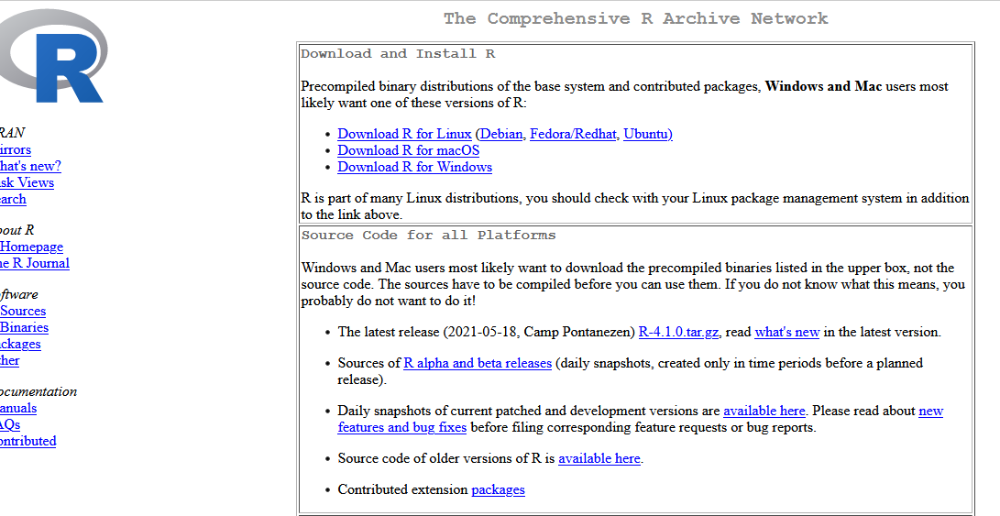
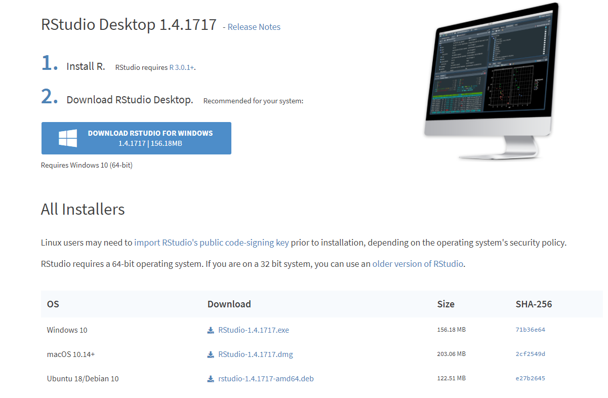
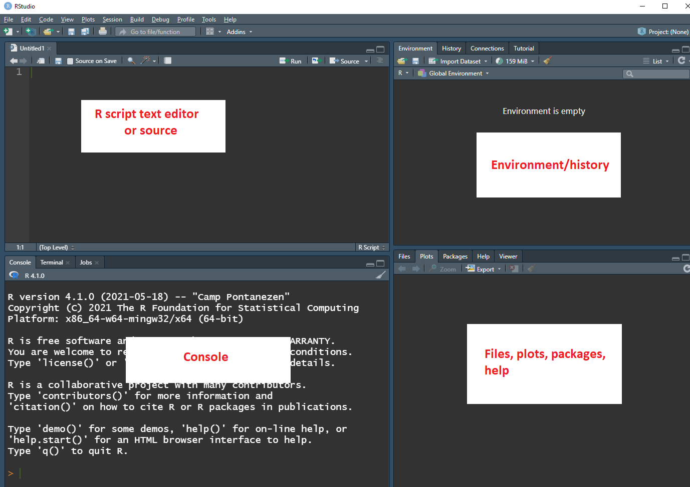
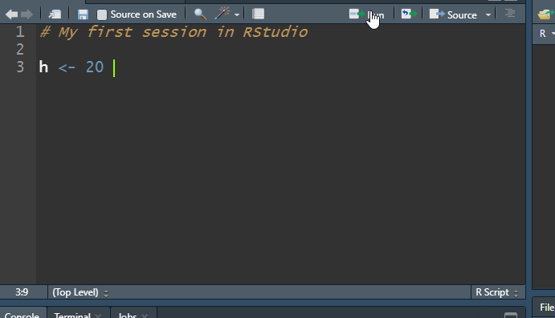

# Introduction: Getting Familiar with R and RStudio {#intro}

 


## What is R and RStudio?

**R** is a GNU project and may be thought of as an implementation of the **S** language (developed at Bell Laboratories by Rick Becker, John Chambers and Allan Wilks).  It is a language and environment for statistical computing and graphics.   **R** contains a large number of built-in functions for classical and modern statistical analysis.  One of the main advantages  of using this program, particularly for undergraduate students, is that it is free! A core team of statisticians and countless other contributors consistently  maintain, update, and improve **R** and make versions that run well on most operating systems.  The web page for the **R** Project for statistical computing is located at <https://www.r-project.org/>.

In this course, we will run **R** through **RStudio**. **RStudio** is an integrated development environment (IDE) that allows you to interact with **R** more readily. **RStudio** is also free to use. For our purpose, we will be using  **RStudio** as a graphical user interface for **R**.   Think of **R** as the engine for a car, whereas **RStudio** is the dashboard, wheel, etc. that allows one to control the engine (although it does so much more such as create slides, books, web applications, and other things).


## Downloading and installing R

The CSUB virtual computer lab will have R and RStudio installed.  If you prefer to install these  on your personal computer, follow these steps:

1. Visit the site <https://cran.r-project.org/>.

2. Click the link that corresponds to your appropriate operating system. (see Figure 1.1).  The directions given are for Windows but the process is fairly  similar for Mac or Linux. Chromebook users will have to use the virtual computer lab to access R and RStudio unless you are proficient in using Linux.

3. Select *base* and download the latest release (the link will state "Download R '*some version*' for Windows")

4. Once the program has downloaded, install **R** with the default settings.  
  
5. That's it!  

  

{ width=80% }


## Downloading and installing RStudio


Follow the steps:

1. Visit the [RStudio IDE downloads page](https://docs.posit.co/ide/user/#rstudio-ide-oss-downloads).

2. Download the RStudio Desktop installer for your operating system. The screenshots below show an earlier version of the download pages; the current layout may differ.

3. Once the program has downloaded, install **RStudio** with the default settings.  
  
4. That's it!  You can now run **RStudio** from your home computer.

</br>

{ width=80% }

</br>

{ width=80% }
 
 
## The layout of RStudio

Open **RStudio**.  The first time you open **RStudio**, you will see three panes (Figure 1.4). A fourth pane is hidden by default, but can be opened by clicking the File drop-down menu, then New File, and then R Script (*File>New File>R Script*).  **RStudio**  should look something like what you see below but perhaps with a different color scheme. Please see me during student hours or before/after lecture if you wish to change the color scheme.


</br>

{ width=90% }

</br>

A brief description of each pane:

- The upper left pane: The **R Script text editor** or **source**.  This is where commands are written before being sent to the console for execution. Writing and saving a series of **R** commands  in the script file makes it easy to reuse or modify code at a later time.

- Lower left pane: the  **console**  pane. Every time you launch **RStudio**, it will have the same text at the top of the  console telling you the version of **R** that you're running.  Below that information is the **R** <span style="color:red">*prompt*</span>  (the symbol `>`).  As its name suggests, this prompt is really a request, a request for a command.  It is here where **RStudio** will tell **R** what to do.  This is the most important pane because this is where **R** actually does stuff and provides output. That is, it is where commands are entered and executed with output printed.

- Upper right pane	contains your **environment/history** pane.
  + In the <span style="color:red">*environment *</span>  tab you can see which data and values **R** has in its memory. **R**'s memory is called an **environment**. 
  + The <span style="color:red">*history*</span>  tab shows what has been typed before. 
  + Don't worry about the rest of the tabs.

- Bottom right pane is the **files/plots/packages/help** pane.   
    + In the <span style="color:red">*Files*</span>  tab you can browse and select files to open.
    + The <span style="color:red">*Plots*</span>  tab will show any plots that you create.
    + The <span style="color:red">*Packages*</span>  tab shows a list of installed R packages (more on R packages later).
    + The <span style="color:red">*Help*</span>  tab is the output location of any help files called (more on help files later).
    

## Expressions and Assignments

R commands can evaluate expressions or assign their results to objects. At the command prompt `>` in the console pane, do the following:

-  Type `25-5` and hit enter. (this is an example of an <u>expression</u>).
- Type `h=25-5` and hit enter (this is an example of an <u>assignment</u>).
This can be read as the difference between 25 and 5 is assigned to the object `h`.
Next type `h` and hit enter.
- Type `H<-20` and hit enter.  Next type `H` and hit
enter.

The result should be as follows


``` r
25 - 5
#> [1] 20
h = 25 - 5
h
#> [1] 20
H <- 20
H  # The pound sign is used for comments
#> [1] 20
```
 
</br>

Notice the following from the commands that were executed above:

- `h` and `H` are not the same thing (they are clearly distinct), so **R** is case sensitive.
- You can also see these new objects  (`H` and `h`) are in your environment tab on the upper right pane. These objects are generally called *R objects*.
- You will get into the habit of saving things in *R objects* so that we can access them at a later time.  During an R session, objects remain in memory unless you remove them.
- When a session ends, objects are not retained unless you save them. RStudio may restore a previously saved workspace at startup, depending on its settings. Saving and rerunning your R script lets you recreate the objects.
- The assignment operator is `=` or `<-`.  Either one is acceptable, although I have a preference for `<-` so most of my handout/notes will reflect this.
- Ordinary R object names start with a letter or a period that is not followed by a digit. The remaining characters can include letters, digits, periods, and underscores. Reserved words such as `if` cannot be used as ordinary object names.
- Outside a quoted string, `#` begins a comment. R ignores the rest of that line.

</br>
 
Back to the *R objects* `H` and `h`.  The objects were created and are now stored in **R**'s memory. So if you type `H` and hit enter again, then 20 will come up.  **RStudio** can be closed by  selecting *File > Quit Session* or you can just enter the command `q()` in the console.  When exiting **RStudio** you will be asked "Save workspace image to ...". If you select "Don't Save", then you will lose everything that is in your memory.   For example, if you were to close without saving and then open **RStudio** again and type `H` you will get an error such as `Error: object 'H' not found`, unless a saved workspace restores it. Saving the workspace is not required for these examples.


## Entering and running R code in RStudio

The easiest way to enter code or commands into **RStudio** is to type a command in the console pane and press enter. But this method is only efficient for short and simple analyses. The recommended way is to use **RStudio**'s text  editor.  Use the built in text editor as follows:

- Open an R script file (*File>New file>R script*). 

- Type in your **R** code or commands into this editor.  For example, type `h <- 20`.

- Save the R script  file as an *.R* file.  For example, save your file as *FirstRsession.R*.

- You may then execute the command `h <- 20` directly from the text
editor without copying and pasting the command. This is done by
highlighting the command, and then selecting the 
"Run" button (the figure below). You should then see the command executed in the
console pane.

{ width=80% }


</br>

**Important**: Always save your R script file periodically so that you may re-run the analysis when necessary (this applies to any assignments or exams).

## A fancy calculator

At its most basic level, **R** can be viewed as a fancy calculator.  While we won't be using **RStudio** to do algebra problems, it is a good way to get familiar with **RStudio**.   The basic operations are `+` (add), `-` (subtract), `*` (multiply), `/` (divide), and powers with the `^` operator. R follows the [order of operations](https://www.khanacademy.org/math/pre-algebra/pre-algebra-arith-prop/pre-algebra-order-of-operations/v/introduction-to-order-of-operations). Type the following on the new line in the editor and select "Run":

``` r
727/163
```


and you should get the output `[1] ` 4.4601227.


Upon selecting "Run", the result of the above appears in the console pane, preceded by the command you executed, and prefixed by the number 1 in square brackets `[1]`.  The `[1]` indicates that this is the first (and in this case only) result from the command. Many commands will return multiple values. Try the following one by one, where each is typed on a new line and then selecting "Run" after typing the command in the editor:

``` r
25*10
	
5/2

2 + 2
```

After running these commands, you should note the following about the R prompt, `>`:

- The `>` prompt means that **R** is content and ready for a new command or input.
- Please note that spacing is not an issue with **R**. For example, `5 / 2` is the same as `5/2`. However, using spaces makes the code <span style="color:red">**easier**</span> to read and catch mistakes.
 

Don't worry about saving your workspace as we generally will not need to do this in the course. 


## Working with vectors

The `c( )` function combines or concatenates terms together into a vector. Suppose we wish to store the values 1, 0, 2, 0, and 3 in a vector and store this result in an object called `x`. To do so, run the following:

``` r
x <- c( 1 , 0 , 2 , 0 , 3 )
x
```

```
## [1] 1 0 2 0 3
```


What is the mean of the data stored in `x`?  We can do this by summing up the values and dividing by 5:

``` r
SumOfx <- 1 + 0 + 2 + 0 + 3 
SumOfx/5
```

```
## [1] 1.2
```
We could also use the `sum( )` function which will add all the elements in a numerical vector:

``` r
sum(x)
```

```
## [1] 6
```

``` r
sum(x)/5
```

```
## [1] 1.2
```

Note the above in summation notation is 
$$
\frac{\sum_{i=1}^5 x_i}{5}
$$

Suppose we wanted to compute the sum below:
$$
\sum_{i=1}^5 x_i^2
$$
We can do this in steps before we use the `sum( )` function:

``` r
x^2
```

```
## [1] 1 0 4 0 9
```

``` r
xsq <- x^2 # assign the squared elements to 'xsq'

sum( xsq )
```

```
## [1] 14
```

What if we wanted to compute the sum below?
$$
\frac{\sum_{i=1}^5 (x_i - \bar{x})^2}{4}
$$
Like before, we do this in steps:

``` r
diffofxANDxbar <- x - sum(x)/5
diffofxANDxbar
```

```
## [1] -0.2 -1.2  0.8 -1.2  1.8
```

``` r
sqdiffofxANDxbar <- diffofxANDxbar^2
sqdiffofxANDxbar
```

```
## [1] 0.04 1.44 0.64 1.44 3.24
```

``` r
sum( sqdiffofxANDxbar ) / 4
```

```
## [1] 1.7
```


## Data types in R 

R has six atomic vector types: double (usually called numeric), integer, complex, character, logical, and raw. A factor is a class for categorical data, stored as integer codes with labelled levels.

We will only deal with numeric, character, factor and logical data types.  Numeric data consists of decimal values. For example,

``` r
j <- 10.355
j
```

```
## [1] 10.355
```

 In **R**, numeric is the default type for numbers. An ordinary numeric literal is stored as a double; integer values can be created explicitly, for example with `10L`. Character data are strings, which can contain zero or more characters. Character data are created by putting the string in quotations.  For example,

``` r
k <- c( "hi", "hello" )
k
```

```
## [1] "hi"    "hello"
```

``` r
L <- "3.4403" # a string since we put it in quotations!
L # this is not numeric
```

```
## [1] "3.4403"
```

Logical values are `TRUE` or `FALSE`; missing logical values are represented by `NA`. Logical values are generally created when there is a comparison between variables.

``` r
p <- c( TRUE, TRUE, FALSE ) # no quotation marks!
p # this is not character data but rather  logical values
```

```
## [1]  TRUE  TRUE FALSE
```

Factor data contains a set of numeric codes with character-valued levels. A simple way to create a factor variable is to first define it as a character variable and then convert it to a factor variable by applying `as.factor( )` to the vector:

``` r
MaritalStatus <- c( "married", "married", "divorced", "single", "single", "widowed", "married" )
MaritalStatus
```

```
## [1] "married"  "married"  "divorced" "single"   "single"   "widowed"  "married"
```

``` r
### convert character variable to factor variable:
MaritalStatus <- as.factor( MaritalStatus )
MaritalStatus
```

```
## [1] married  married  divorced single   single   widowed  married 
## Levels: divorced married single widowed
```

An atomic vector has one underlying type. If you combine values of different types with `c()`, R generally converts them to a common type. For example, `c(1, "two")` produces the character vector `c("1", "two")`.  Further, you are not expected to be able to create factor variables (or other data types), but rather you are expected to only recognize and distinguish between these data types.


## Comments in R

Outside a quoted string, everything after `#` on a line is a comment and is ignored by **R**. Adding comments to your R script is useful because it will help you recall what your commands or lines of code will do. In the editor,  type the following and select "Run":

``` r
### Comments are ignored by R!
y = 1 + 3    # this command tells R to compute 1 plus 3 and assign it to an R object called  y
```

Note that `y` is now in **RStudio**'s memory, and we can access its value by typing `y` on a new line and selecting "Run". Now, type the following in your editor on a new line and then select "Run":

``` r
# z = 3 - 7  # this code  is ignored because of # `
```

Note that this command is ignored because of `#`.  Get into the habit of using comments!


## Using R functions

**R** has many built-in functions. For example, the `c( )`
function combines, or concatenates terms together 
into a vector.

Suppose we wish to assign the values 

```
1  0  2  0  3  1  0  1  2  0
```

to a vector denoted by `X`.  In your R script, run the code
given below:
```
X <- c(1, 0, 2, 0, 3, 1, 0, 1, 2, 0)

X
```

You should have obtained output as follows:

``` r
X <- c(1, 0, 2, 0, 3, 1, 0, 1, 2, 0)

X
##  [1] 1 0 2 0 3 1 0 1 2 0
```

The output appears below the code. The `#>` prefix in these notes distinguishes output from code; it is not part of the value printed in the R console. To recall earlier console commands, use the up and down arrow keys.

Another example of an **R** built-in function is the `sum( )`. This function computes the sum of all the numbers in a vector.  The syntax consists of the function name followed by parentheses to contain the argument(s). For this example, pass the data vector to `sum()`. The function can also sum several arguments. We will make use of R's many built in functions along the way. Examples of other functions are shown below:
 

``` r
### computing the mean of the numbers stored in X
mean(X)  # sample mean
#> [1] 1

### compute the length of the vector
length(X)
#> [1] 10

# more on functions later.
```

## Loading a package and installing new packages

R's built-in functions are supplied by packages; you can also define your own functions.  There are many *packages*   that can be installed to expand the ability of R.  By default, R comes with several packages installed (some loaded automatically when R starts and some not). For example, a function called `mean()`  is available from the `base` package, and this package is loaded automatically when R starts, so we can use this function without loading an additional package.

As for those packages that aren't loaded automatically, we first have to load a package to use its "tools".  For example,the `MASS` package comes with **R** but is not automatically loaded. This package provides a function called `boxcox()` (for Box-Cox transformations).  To use `boxcox()`, we first have to load this package by running the command `require(MASS)` or `library(MASS)`.

Remember to think of *packages* as toolboxes.  We will install additional *packages*   called `openintro` and  `mosaic` that will provide useful data sets and functions ("tools"). These packages are specifically designed to make **R** more accessible.


To install these packages, in the **R** console type the following command:

``` r
install.packages( "openintro" )  # no spaces within quotation marks!
```

Hit enter, and you will see activity occurring in the **R console**. This may take a few minutes to complete. Note the following during the installation process:

+ If R asks you to choose a CRAN mirror for downloading, select any *USA* mirror.
+ If R asks to use your personal library, answer yes.
+ If R prompts you to update any packages, please agree to the updates.

When it is done installing, check that the console reports no installation error. A message about downloaded packages alone does not confirm that every package installed successfully.
 
Now install the `mosaic` package. In the **R** console type and run the following command:

``` r
install.packages( "mosaic" )     # no spaces within quotation marks!
```

Again, this may take a few minutes to complete.  Note that these packages only have to be installed once on your computer. However, every time a new RStudio session is started, the package will have to be loaded before datasets and/or functions from the package can be used. If a different computer is being used, these packages will have to be installed again. For now, only these additional packages are required.
 


