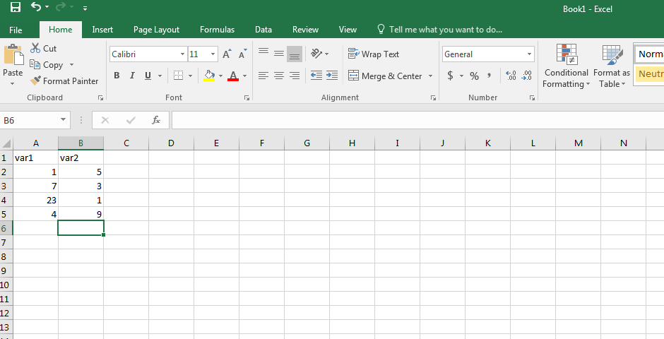
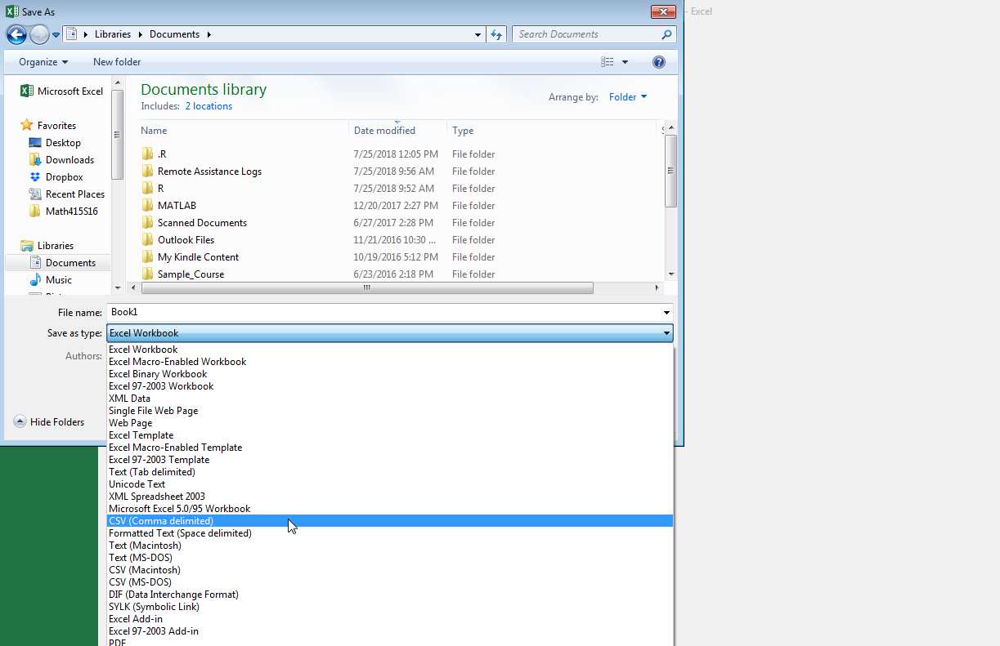
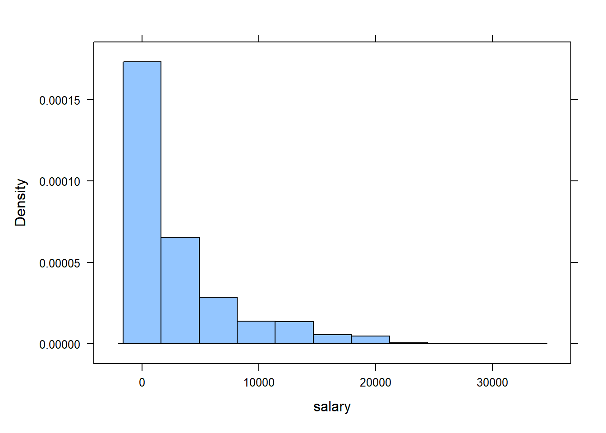
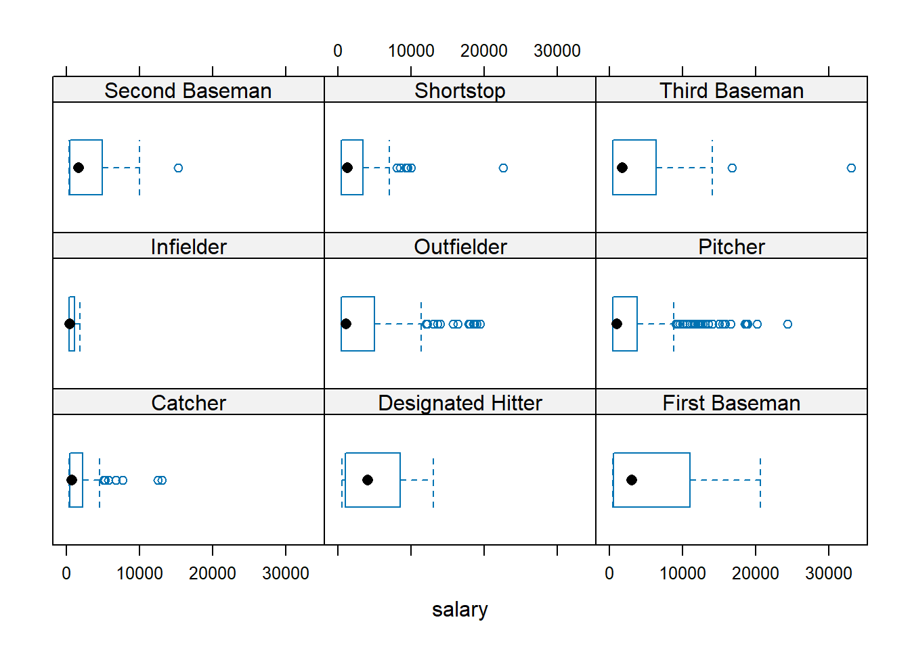
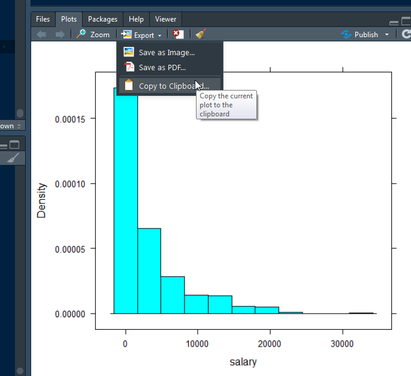
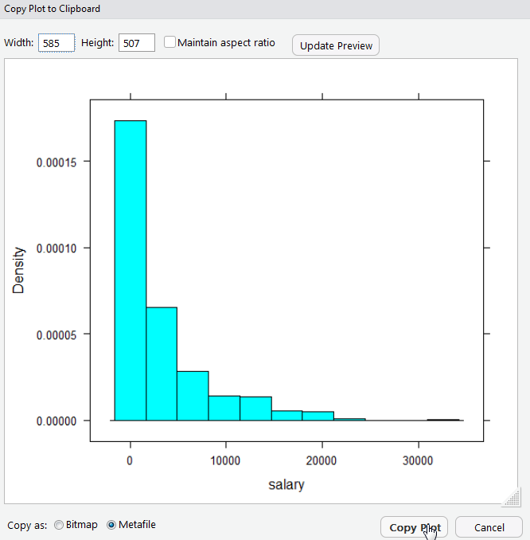

# Some basic R tasks {#basics}

 

By now you the "Look and Feel" of the **RStudio** environment should be familiar.  In this chapter we discuss some basic task in **R** (importing data, loading data, summarizing data, help files, and common errors).   Recall that in R one is either creating an expression or an assignment.  As for assignments,  (i.e., `H <- 20`), the create *R objects* we assigned something to an object (i.e., `H <- 20`), this object


## Using R’s built-in datasets and "viewing" datasets

Take a look at the Environment tab in the top right pane. Any datasets that you import into **R** or any loaded datasets (that come with **R**) will appear in this tab.  In this course, we will either import a dataset that is stored in a .csv file or using a dataset that already comes with **R** (by way of an **R** package.  Here, we illustrate using a dataset that already comes with R. The dataset is the resulting measurements from an experiment on the effect of diet on early growth of chicks.

**R** refers to this dataset as `ChickWeight`. We can look at this data by first telling ***R** that we want to use it by using following command:

```r
data( ChickWeight )  # this tells R that we want to use the 'ChickWeight` data
# It should now appear in R's memory (see Environment tab)
# Note: This command may open a spreadsheet of the data in
# a new tab.  Simply close the tab and return to your R script
# file.
```

We can now look at the data within the console by  typing its name in the R script, highlighting it, and selecting "Run"

```r
ChickWeight 
```

It's going to print a lot of data (578 rows of it). To view the data in a spreadsheet, click on the name `ChickWeight` in the Environment tab (upper right pane).  This will open a spreadsheet of the data in a new tab in the source pane.

What you should see in the spreadsheet are four columns of numbers, each row representing a chick measured: the first entry in each row is simply the row number (an index we can use to access the data from individual chicks if we want), the second is the `weight` (body weight of the chick), the third is `Time` (number of days since birth) , the fourth `Chick` (an identifier for the chick), and the fifth is `Diet` (experimental diet the chick received: Diet 1 , 2, 3, or 4). You can use the scroll bar on the right side of the console window to examine the complete data set. 

Alternatively, to open the data spreadsheet, one can instead run:

```r
View( ChickWeight ) 
```

Note that the row numbers in the first column are not part of ChickWeight’s data. R adds them as part of its printout to help you make visual comparisons. You can think of them as the index that you see on the left side of an Excel spreadsheet. In fact, the comparison to a spreadsheet will generally be helpful. R has stored `ChickWeight` dataset in a kind of spreadsheet or table called a **dataframe**.  Rather than looking at the spreadsheet of the data, we can instead explore the **dataframe** in various way to extract useful characteristics. For example, one can see how many variables (chick characteristics of interest) were measured/recorded and the number of observations on these variables by running:

```r
require( mosaic ) # tell R we want to use the mosaic package

glimpse( ChickWeight )
```

The R function/command called `glimpse( )` is part of the `mosaic` package.  This is why one has to first run `require( mosaic )`

In general, datasets that come with R or an R package, such as `ChickWeight` have what is called a *help file* that will provide details regarding the data set.  Help files are disscuseed later in this chapter.


## .csv files


It is assumed you have used an excel spreadsheet.  If not, please view the tutorial  [Excel Tutorial for Beginners](https://www.youtube.com/watch?v=rwbho0CgEAE) . 

Data sets used in this class will either be built-in datasets (that is, they come with R or from an R package) or  they will be *.csv* files. A *.csv* may be viewed with Microsoft Excel. We will import .csv files into RStudio. If you have data that you want to import into RStudio, you will first store your data in a .csv file using Excel. The format in which you store it should be a **data matrix** or in **tidy form**. There are three characteristics that make a dataset a data matrix or tidy:

- Each variable must have its own column.
- Each observation must have its own row.
- Each value must have its own cell.


To setup your spreadsheet, do the following steps: 

+ Step 1 -- Input and organize your data in Excel.
  + Organize your data in an Excel worksheet, such that the first row (Row 1) contains the column names and  each subsequent row contains all the necessary information for each data point. For example:
  
{ width=80% }

+ Step 2 -- Save your worksheet as a comma separated values (.csv) file type. Select the following Excel tabs *File>Save As*, then select where you want to save your .csv file. A window will appear in which one can specify their desired *filename* as well as their desired *file type*.  Enter a file name and click on "Save as type" and scroll down to select **CSV (Comma delimited)** (see figure below). 

{ width=80% }

When you click to save the worksheet as a comma separated file (.csv), Excel may present you with a one or two warnings. One may warn you that the .csv format cannot accommodate multiple worksheets. That's fine; just click "Yes" to save the active worksheet. The second warning tells you that "Some features in your workbook might be lost if you save it as a CSV (Comma delimited)."  Again, that's fine, just click "Yes". When you're done, you will see that a new file has been created in the directory where you saved your file. If you were to open this file in excel you would see your spreadsheet with the data you entered.  On the surface, it looks no different than an excel spreadsheet file (.xls or .xlsx)

**Important:** Any *.csv* file that you plan to import into **R** must have  the first row (Row 1) contain the column names and  each subsequent row contains all the necessary information for each data point. 


## Importing a .csv file

We will use the  **R** function `read.csv()` to import data into **RStudio**. We illustrate the method using the "MLB salaries (2010)" data set and this data is stored in a .csv file.  This .csv file is located at the following url: [http://www.csub.edu/~emontoya2/datasets/mlb2010.csv](http://www.csub.edu/~emontoya2/datasets/mlb2010.csv)

To import the data into RStudio, we use `read.csv()` and it is a simple function to use.  It just requires the location of the file.  If the data location is a url, then use the url.  If it is data that you've created or recorded and it is saved on your computer, then we use `file.choose()`.   We will cover both methods here.

###  Importing data via a url 

This only works if the *.csv* has a url location. The "MLB salaries (2010)" data set is located  at the following url:

Link: [http://www.csub.edu/~emontoya2/datasets/mlb2010.csv](http://www.csub.edu/~emontoya2/datasets/mlb2010.csv)

To import, run

```r
mlbDataImport = read.csv( "http://www.csub.edu/~emontoya2/datasets/mlb2010.csv" )
```

The `mlbDataImport` dataframe should now appear under the "Environment tab". 


*Important*: The url must be in quotations and NO spaces at the start after the quotation or right before the end of the quotation.  For example, you will get an error if you use the following urls:

+ `" http://www.csub.edu/~emontoya2/datasets/mlb2010.csv"`
+ `"http://www.csub.edu/~emontoya2/datasets/mlb2010.csv "`
+ `" http://www.csub.edu/~emontoya2/datasets/mlb2010.csv "`
+ They look similar to what we used but it has spaces within the quotation marks!
	

### Importing data from your computer

Download the *.csv* file below onto your computer.  Make sure to  note where your file is saved. Depending on your browser settings, after clicking on the link below, the file will either open in your browser and it will be downloaded.  
 
[http://www.csub.edu/~emontoya2/datasets/sampledata.csv](http://www.csub.edu/~emontoya2/datasets/sampledata.csv)

After saving this *.csv* file, run the following

```r
### by putting in "file.choose()", this tells R that you want 
### to browse for and select the csv file
ImportFromDrive = read.csv( file.choose() )
```

This automatically opens a window that allows you to browse for your *.csv* file. Select your file and click on *Open*.  You should see the following in the console  

{ width=80% }

The data set `ImportFromDrive` should appear in the *Environment* tab in the upper right panel where it displays the number of observations and variables. 

**Note**: Data that you import will not have help files. Only datasets that come with R (or from R packages) have help files.


## Using RStudio's data import feature


Alternatively, one can take a “point and click” approach to importing data. Like most software, RStudio has a toolbar where you can access many commands. To import data using the toolbar menu, select *File>Import Dataset> From Text (base)*. Then select your *.csv* file. If you data is stored in an excel spreadsheet (.xlsx), then select “From Excel”.


##  Summarizing data

There are many ways to summarize data in **R**.  We will be using functions from the `mosaic` package.  From hereafter, always load the `mosaic` package.  That is, always have the following in your R script before writing any commands to conduct any analysis:

```r
require( mosaic )
require(pillar)
```

When wanting to summarize a single variable, the formula to create graphical and numerical summaries follows the general form `goal( ~ x , data)` where `x` is the variable you want to graph or compute a statistic of. Depending on the summary, we may have to specify some additional things.  If the variable `x`  is a variable in the dataframe/dataset, then data would be set equal to the name of the data frame. The names used for `x` and the name of the dataframe must be the names that R has given the data set and variable. `goal` would be replaced with the name of the function.

Recall that we imported the MLB dataset and we stored it in a dataframe called `mlbDataImport`. Let's take a glimpse at the data

```r
glimpse( mlbDataImport )  # this function is from the mosaic package
## Rows: 828
## Columns: 4
## $ player   <chr> "Brandon Webb", "Danny Haren", "Chris Snyder", "Edwin Jackson…
## $ team     <chr> "Arizona Diamondbacks", "Arizona Diamondbacks", "Arizona Diam…
## $ position <chr> "Pitcher", "Pitcher", "Catcher", "Pitcher", "First Baseman", …
## $ salary   <dbl> 8500.000, 8250.000, 5250.000, 4600.000, 4500.000, 4185.000, 3…
```

Let's start with a simple graphical summary.  R has three plotting systems: *base*, *lattice*, and *ggplot2*.  We will be using the lattice system, which comes from the `lattice` package.  This package is automatically installed when you installed the `mosaic` package, and this package is automatically loaded when you loaded the mosaic package (`require( mosaic )`). 

To start, a histogram of `salary` will created.  `salary` represents the salary (in $1000s) of a given baseball player in 2010.  Again, the basic formula is `goal( ~ x , data)` where `goal` would be replaced with the name of the function to create the desired graph.  **R** refers to histograms as `histogram()`:

```r
histogram( ~ salary  , data=  mlbDataImport ) 
```



Let's compute the mean salary of these baseball players.  Again, `salary` represents the salary of a given baseball player in 2010. As with the graph, the basic formula is `goal( ~ x , data)` where `goal` would be replaced with the name of the function to compute the desired sample statistic.  To compute the mean, **R** calls its function `mean`:

```r
mean( ~ salary  , data=  mlbDataImport )
## [1] 3281.828
```


Suppose you wanted to compute the average salary for each position. To so, we can tell RStudio to compute the mean by levels/groups of a grouping variable. A grouping variable groups data into categories or groups. Grouping variables are categorical variables.  When summaries are desired based on the levels or groups of the grouping variables, they are called side-by-side or comparative summaries. 

For any  side-by-side or comparative data summary, the general formula changes a bit. The formula is `goal( ~ x | gfactor , data)`, where `gfactor` represent the grouping variable. In our example, the grouping variable is `position`:

```r
mean( ~ salary | position , data=  mlbDataImport )
##           Catcher Designated Hitter     First Baseman         Infielder 
##          1937.220          5235.714          5826.521           770.575 
##        Outfielder           Pitcher    Second Baseman         Shortstop 
##          3753.926          2999.197          3022.723          2844.146 
##     Third Baseman 
##          4641.286
```

One may also create a side-by-side or comparative graphical summary. To create a boxplot of `salary` for each position, run the following: 

```r
bwplot( ~ salary | position , data=  mlbDataImport )
```




## Export an R plot or R output 


### Exporting graphs

One may need to create a graph or one may have to submit *RStudio* output for certain assignment or exam problems.  To export a plot, go to the *Plots* tab in the bottom right panel, click on *Export>...*.

{ width=80% }

You have three export format options: 

+ "Save as Image..."
+ "Save as PDF..."
+ "Copy to Clipboard..."

Select your preferred option. A small window should then appear of the plot. In the pop up window you may adjust the size of the plot and provide a name for the new file (see below for an example when one selects "Copy to Clipboard...").

{ width=80% }

### Exporting R output

If **R** output is requested, then highlight and copy the output from the **R** console.  It may then be pasted in your Word or Google Doc document. Alternatively, you take a screen shot of the desired output. 
 
 
## Extracting variables from dataframes

To extract a given variable from a dataframe, we place a `$` at the end of the dataframe name, followed by the variable name.  To illustrate, we use R's built-in dataset called `trees`, which contains the diameter, height and volume for 31 cherry trees:

```r
glimpse( trees )
## Rows: 31
## Columns: 3
## $ Girth  <dbl> 8.3, 8.6, 8.8, 10.5, 10.7, 10.8, 11.0, 11.0, 11.1, 11.2, 11.3, …
## $ Height <dbl> 70, 65, 63, 72, 81, 83, 66, 75, 80, 75, 79, 76, 76, 69, 75, 74,…
## $ Volume <dbl> 10.3, 10.3, 10.2, 16.4, 18.8, 19.7, 15.6, 18.2, 22.6, 19.9, 24.…
```

To extract the variable `Volume`, do the following:

```r
trees$Volume 
##  [1] 10.3 10.3 10.2 16.4 18.8 19.7 15.6 18.2 22.6 19.9 24.2 21.0 21.4 21.3 19.1
## [16] 22.2 33.8 27.4 25.7 24.9 34.5 31.7 36.3 38.3 42.6 55.4 55.7 58.3 51.5 51.0
## [31] 77.0

### Lets store the volume measurements
### into an R objects called 'treeVol'.
### We can then call 'treeVol' whenever
### we need to use these measurements.
treeVol <- trees$Volume # assign vol. meas. to 'treeVol'
```

 


## Understanding common R errors
 
Everyone gets errors in **R**.  It's part of the process of learning any new software. Here are some of the most common error you may encounter and what they mean

### could not find function

Example:

```r
> whatIsThis( 4 ) # no such function/command exist
Error in whatIsThis(4) : could not find function "whatIsThis"
```

This error usually occurs when

+ you are using an **R** formula or function that does not exist.
+ It exist, but you haven't loaded the *R* package that has this function/formula. Remember to always run `require( mosaic )` when you start **RStudio**.
+ You misspelled the name of the function. For example, the first command works, but the second does not (R is case sensitive!)

```r
mean( ~ salary  , data=  mlbDataImport )
## [1] 3281.828
```


```r
> Mean( ~ salary  , data=  mlbDataImport )
Error in Mean(~salary, data = mlbDataImport) : 
  could not find function "Mean"
```

### object not found

Example: 

```r
> MlbDataImport
Error: object 'MlbDataImport' not found
```

This error usually occurs because the object has not been defined.  You will also frequently see this when you've mistyped the name of the object you think you are referencing.  Remember **R** is case sensitive! The name of the data set is `mlbDataImport` not `MlbDataImport`.

### Unmatched parenthesis

Another common error is forgetting or neglecting to finish a call to a function/formula with a closing `)` or adding too many parenthesis. An example of this follows:

```r
> histogram( ~ salary  , data=  mlbDataImport ) ) ) 
Error: unexpected ')' in "histogram( ~ salary  , data=  mlbDataImport ) )
```

If you forget a parenthesis, R will just keeping prompting you by returning `+`:

```r
> histogram( ~ salary  , data=  mlbDataImport 
+ 
+ 
+ 
+ 
### Hit the 'Esc' key a few times to have
### R stop prompting.  
```


###  The ‘Some package’ package is not available (for R version 'some version')

This generally means that:

- A package named ‘Some package’ exists but it's not available for your version of R (not a common error for this type of class)
- No package exisit with the name ‘Some package’ (a more common error)

It is likely that you misspelled the name, were not careful with case-sensitivity, or inserted spaces at the start/end of the package name.   
 

Please keep in mind that everyone commits errors them when learning a new software.  Oftentimes, you will find that you are able to understand what they mean by carefully reading over them. When you can't, carefully look over your R file and consider posting your question on the "Student-led RStudio Q&A" discussion board or scheduling a student hour appointment.  


## Help files


All built in functions, as well as data sets, in **R** have help files.  To access the help files for a function or data set one uses the function `help( )`.  In general, the help file will contain the following sections:
  
- Description: Gives brief description of the function.
- Usage: Displays a functions arguments, along with the default values of certain arguments.
- Arguments: Gives details of each of the functions arguments.
- Value: Describes what is returned by the function.
- See Also: Lists links to help files of similar functions.
- Example: Gives example code that uses the function(s).

For example, the following commands bring up the help file on
the `log( )` function,

```
> help(log)
Help for 'log' is shown in the browser
> ?log  # This is equivalent to help(log)
Help for 'log' is shown in the browser
>
```

Either of these commands should open the following (abbreviated)
help file

```
log {base}                                 R Documentation

Logarithms and Exponentials Description

log computes natural logarithms, log10 computes common (i.e., base 10)
logarithms, and log2 computes binary (i.e., base 2) logarithms.
The general form logb(x, base) computes logarithms with base base.

Usage:
  
log(x, base = exp(1))
logb(x, base = exp(1))
log10(x)
log2(x)

Arguments:
  
  x       a numeric or complex vector.
base    positive number. The base with respect to which logarithms
are computed. Defaults to e=exp(1).

Value:
  
  A vector of the same length as x containing the transformed
values. log(0) gives -Inf (when available).

...

Examples:
  
  log(exp(3))
log10(1e7)# = 7
```

The function `log()` has two arguments.  The first 
is a numeric vector and the second corresponds to the 
base.  By default the function `log()` will
evaluate with an exponential base unless you specify otherwise
as illustrated below. 

```
> log(10)
[1] 2.302585
> log(10, base = exp(1))
[1] 2.302585
> log(10, base = 2)
[1] 3.321928
>
```

If you seek an example of using a given function, it is a good idea to look at the examples given at the end of the help file. Now suppose you had no idea that a logarithm function existed, but you would like
to know if such a function might exist in **R**.  To explore this question you can issue 
`help.search( "logarithm" )` which will search the help files for documentation matching the 
character string `logarithm`.  You may also run `RSiteSearch( "logarithm" )` which will search
for the  character string "logarithm" in the R-help mailing list archives.  Lastly, you can do a web search for your error as it is almost certain someone has had the same or similar error.


