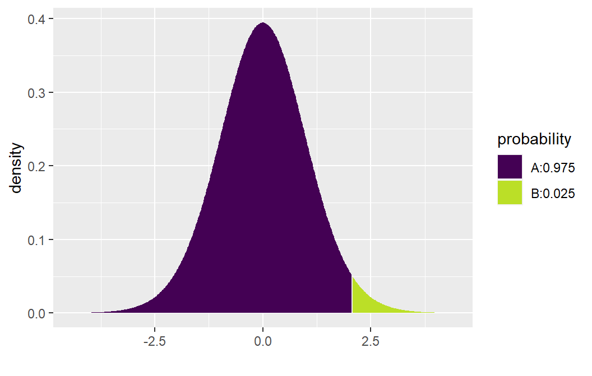
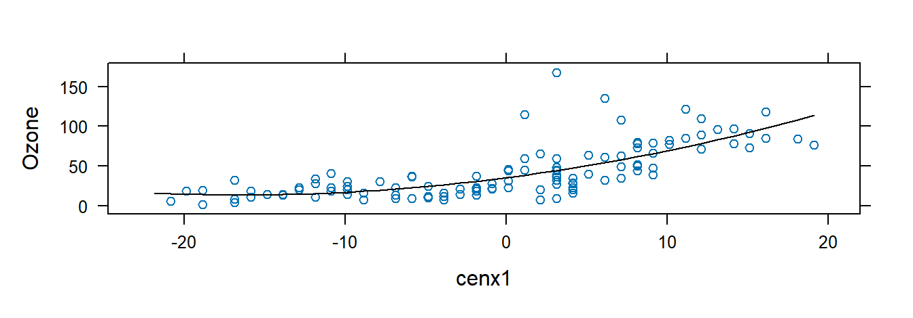
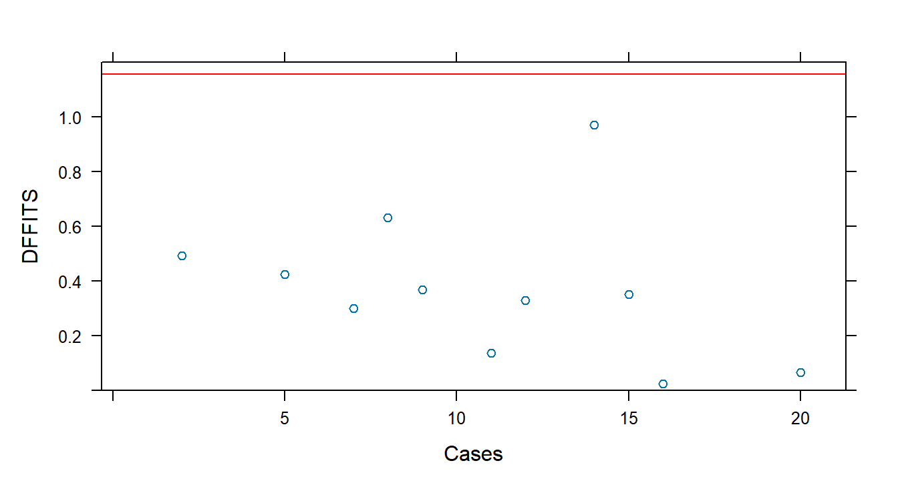
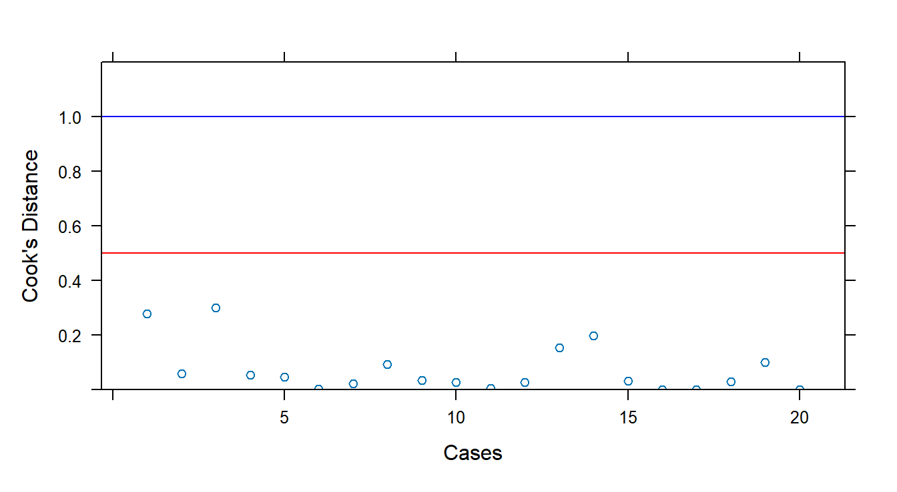

# R code for Regression Analysis {#reg}

This chapter shows how to use **R** for methods covered in a regression analysis course. Some examples follow:

Kutner M.H., Nachtsheim C.J., and Neter, J., *Applied Linear Regression Models*, McGraw-Hill/Irwin.

We refer to this text as ALRM. Datasets are available at:

[https://www.csub.edu/~emontoya2/datasets/textbookdata/index.html](https://www.csub.edu/~emontoya2/datasets/textbookdata/index.html)

## Linear Regression with One Predictor Variable

We illustrate simple linear regression (SLR) using the Toluca Company example from ALRM. The model is:
$$
y_i=\beta_0+\beta_1 x_i + \varepsilon_i  
$$
Here, $y_i$ is the response, $x_i$ the predictor, and errors $\varepsilon_i$ are independent, have mean 0, and constant variance $\sigma^2$.

We use **R** to generate scatterplots, estimate coefficients, obtain fitted values, residuals, and estimate $\sigma^2$.

### Scatterplots

Scatterplots show the relationship between two variables. For bivariate data, the general plotting syntax is `goal(y ~ x, data)`, where `y` is the response and `x` the predictor. To create a scatterplot, use `xyplot`.

Importing the Toluca data:

``` r
require(mosaic)

# Dataset is plain text without variable names, so we customize read.csv
url <- "http://www.csub.edu/~emontoya2/datasets/textbookdata/Kutner/Chapter%20%201%20Data%20Sets/CH01TA01.txt"
toluca.data <- read.csv(url, header=FALSE, col.names=c("xvar", "yvar"), sep="")
```

Preview the data:

``` r
glimpse(toluca.data)
```

```
## Rows: 25
## Columns: 2
## $ xvar <int> 80, 30, 50, 90, 70, 60, 120, 80, 100, 50, 40, 70, 90, 20, 110, 10…
## $ yvar <int> 399, 121, 221, 376, 361, 224, 546, 352, 353, 157, 160, 252, 389, …
```

Use variable names `yvar` and `xvar` in plotting functions:

``` r
xyplot(yvar ~ xvar, data=toluca.data)
```


Other useful `xyplot()` arguments:
```
xyplot(y ~ x | gfactor, data, main, xlab, ylab, col, pch)
# y: response variable
# x: predictor
# gfactor: optional grouping factor
# data: data frame
# main: plot title
# xlab, ylab: axis labels
# col: point color
# pch: symbol type (1–25)
```


### Least Squares (LS) Estimates

We can compute LS estimates either by applying the algebraic formulas or using the `lm()` function. The general form is `lm(y ~ x, data)`.

Recall the LS estimators:
$$
b_1=\frac{\sum (x_i-\bar{x})(y_i-\bar{y}) }{\sum (x_i-\bar{x})^2}, \quad b_0=\bar{y}- b_1\bar{x}
$$

We apply these in **R**:

``` r
myx <- toluca.data$xvar
myy <- toluca.data$yvar

XminusXbar <- myx - mean(~myx)
YminusYbar <- myy - mean(~myy)
XminusXbarSq <- XminusXbar^2

b.1 <- sum((myx - mean(~myx)) * (myy - mean(~myy))) / sum((myx - mean(~myx))^2)
b.1
```

```
## [1] 3.570202
```

``` r
b.0 <- mean(~myy) - b.1 * mean(~myx)
b.0
```

```
## [1] 62.36586
```

Thus, $b_1=3.570$ and $b_0=62.366$.

Alternatively, use `lm()` with the dataframe and variable names:

``` r
lm(yvar ~ xvar, data=toluca.data)
```

```
## 
## Call:
## lm(formula = yvar ~ xvar, data = toluca.data)
## 
## Coefficients:
## (Intercept)         xvar  
##       62.37         3.57
```

To access more model details, save the result to an *lm object*:

``` r
toluca.fit <- lm(yvar ~ xvar, data=toluca.data)
```

Summarize to view coefficients and more:

``` r
summary(toluca.fit)
```

```
## 
## Call:
## lm(formula = yvar ~ xvar, data = toluca.data)
## 
## Residuals:
##     Min      1Q  Median      3Q     Max 
## -83.876 -34.088  -5.982  38.826 103.528 
## 
## Coefficients:
##             Estimate Std. Error t value Pr(>|t|)    
## (Intercept)   62.366     26.177   2.382   0.0259 *  
## xvar           3.570      0.347  10.290 4.45e-10 ***
## ---
## Signif. codes:  0 '***' 0.001 '**' 0.01 '*' 0.05 '.' 0.1 ' ' 1
## 
## Residual standard error: 48.82 on 23 degrees of freedom
## Multiple R-squared:  0.8215,	Adjusted R-squared:  0.8138 
## F-statistic: 105.9 on 1 and 23 DF,  p-value: 4.449e-10
```

Or use `coef()` to extract just the coefficients:

``` r
coef(toluca.fit)
```

```
## (Intercept)        xvar 
##   62.365859    3.570202
```

### Plotting the Estimated Regression Line

We can plot the fitted line using either `xyplot()` or `plotModel()`.

#### Using `xyplot()`

Add the estimated line with `type = c("p", "r")`:

``` r
xyplot(yvar ~ xvar, data=toluca.data, type=c("p", "r"))
```


#### Using `plotModel()`

This plots both data and the estimated line:

``` r
plotModel(toluca.fit)
```


To customize aesthetics, use `xyplot()`:

``` r
xyplot(yvar ~ xvar, data=toluca.data, type=c("p", "r"), 
       xlab="Explanatory variable", ylab="Response variable", 
       main="Estimated LS line", col="green", pch=3)
```


### Fitted or Predicted Values

To get fitted values $\hat{y}_i = b_0 + b_1 x_i$, use:

``` r
fitted.values(toluca.fit)
```

```
##        1        2        3        4        5        6        7        8 
## 347.9820 169.4719 240.8760 383.6840 312.2800 276.5780 490.7901 347.9820 
##        9       10       11       12       13       14       15       16 
## 419.3861 240.8760 205.1739 312.2800 383.6840 133.7699 455.0881 419.3861 
##       17       18       19       20       21       22       23       24 
## 169.4719 240.8760 383.6840 455.0881 169.4719 383.6840 205.1739 347.9820 
##       25 
## 312.2800
```

``` r
predict(toluca.fit)
```

```
##        1        2        3        4        5        6        7        8 
## 347.9820 169.4719 240.8760 383.6840 312.2800 276.5780 490.7901 347.9820 
##        9       10       11       12       13       14       15       16 
## 419.3861 240.8760 205.1739 312.2800 383.6840 133.7699 455.0881 419.3861 
##       17       18       19       20       21       22       23       24 
## 169.4719 240.8760 383.6840 455.0881 169.4719 383.6840 205.1739 347.9820 
##       25 
## 312.2800
```

To predict values at new $x$ values (e.g., 31 and 119), use:

``` r
newdat <- data.frame(xvar=c(31, 119))
predict(toluca.fit, newdata=newdat)
```

```
##        1        2 
## 173.0421 487.2199
```


### Residuals

Residuals are the differences between observed and fitted values: $e_i = y_i - \hat{y}_i$. Use `residuals()` on an *lm object*:

``` r
residuals(toluca.fit)
```

```
##           1           2           3           4           5           6 
##  51.0179798 -48.4719192 -19.8759596  -7.6840404  48.7200000 -52.5779798 
##           7           8           9          10          11          12 
##  55.2098990   4.0179798 -66.3860606 -83.8759596 -45.1739394 -60.2800000 
##          13          14          15          16          17          18 
##   5.3159596 -20.7698990 -20.0880808   0.6139394  42.5280808  27.1240404 
##          19          20          21          22          23          24 
##  -6.6840404 -34.0880808 103.5280808  84.3159596  38.8260606  -5.9820202 
##          25 
##  10.7200000
```

``` r
e <- residuals(toluca.fit)
```

Alternatively, compute them directly:

``` r
yhat <- fitted.values(toluca.fit)
e <- toluca.data$yvar - yhat
```

### `summary()` Output

The `summary()` of an *lm object* includes estimates, standard errors, test statistics, p-values, MSE, $R^2$, and more.

{ width=90% }

### Estimating $\sigma^2$

Estimate error variance using:

``` r
n <- 25
sum(e^2) / (n - 2)
```

```
## [1] 2383.716
```

The `summary()` also provides $\hat{\sigma} = \sqrt{MSE}$; here, $\hat{\sigma}^2 = 48.82^2 = 2383.392$.

## Inference in Simple Linear Regression

This section covers inference on regression parameters, mean response, prediction intervals, ANOVA, and association using **R**.

### Inferences for $\beta_0$ and $\beta_1$

We use the Toluca data to perform inference on slope and intercept. Although most attention focuses on $\beta_1$, similar steps apply for $\beta_0$.

Use `summary()` to obtain test statistics and p-values:

``` r
summary(toluca.fit)
## 
## Call:
## lm(formula = yvar ~ xvar, data = toluca.data)
## 
## Residuals:
##     Min      1Q  Median      3Q     Max 
## -83.876 -34.088  -5.982  38.826 103.528 
## 
## Coefficients:
##             Estimate Std. Error t value Pr(>|t|)    
## (Intercept)   62.366     26.177   2.382   0.0259 *  
## xvar           3.570      0.347  10.290 4.45e-10 ***
## ---
## Signif. codes:  0 '***' 0.001 '**' 0.01 '*' 0.05 '.' 0.1 ' ' 1
## 
## Residual standard error: 48.82 on 23 degrees of freedom
## Multiple R-squared:  0.8215,	Adjusted R-squared:  0.8138 
## F-statistic: 105.9 on 1 and 23 DF,  p-value: 4.449e-10
```

{ width=90% }

From the output, we get $b_1$ and $b_0$, their standard errors, and t-values.

You can also compute $t = b_1 / s\{b_1\}$ manually:

``` r
MSE <- sum(e^2) / (n - 2)
sd.b1 <- sqrt(MSE / sum((myx - mean(~myx))^2))
t.star <- b.1 / sd.b1
t.star
## [1] 10.28959
```

Under $H_0$, the test statistic follows $t_{n-2}$.

To compute p-values:
- For $H_a: \beta > 0$, use:

``` r
xpt(q = 10.290, df = n - 2, lower.tail = FALSE)
```


```
## [1] 2.222735e-10
```

- For $H_a: \beta < 0$:

``` r
xpt(q = 10.290, df = n - 2, lower.tail = TRUE)
```


```
## [1] 1
```

- For $H_a: \beta \ne 0$:
$$2 \times P(t_{n-2} > |10.290|) = .0000000004$$

### Confidence Interval for $\beta_1$

The CI formula is:
$$
b_1 \pm t_{1-\alpha/2, n-2} s\{b_1\}
$$

To compute $t_{1 - .05/2, 23}$:

``` r
xqt(1 - .05/2, df = n - 2)
```



```
## [1] 2.068658
```

Then compute bounds:

``` r
b1 <- 3.570
sb1 <- 0.347

b1 - 2.069 * sb1
## [1] 2.852057
b1 + 2.069 * sb1
## [1] 4.287943
```

Or use `confint()`:

``` r
confint(toluca.fit, level = 0.95)
##                2.5 %     97.5 %
## (Intercept) 8.213711 116.518006
## xvar        2.852435   4.287969
```
```


### CI for the Mean Response ($E(y_h)$) and a Prediction Interval for $y_h$

To compute a CI for $E(y_h)$ at $x_h = 100$, use `predict()` with arguments `interval = "confidence"` and the desired level:

``` r
X.new <- data.frame(xvar = c(100))
predict.lm(toluca.fit, newdata = X.new, interval = "confidence", level = 0.90)
```

```
##        fit      lwr     upr
## 1 419.3861 394.9251 443.847
```

To get a prediction interval for a new $y_h$ at $x_h = 100$, change `interval` to `"prediction"`:

``` r
predict.lm(toluca.fit, newdata = X.new, interval = "prediction", level = 0.90)
```

```
##        fit      lwr      upr
## 1 419.3861 332.2072 506.5649
```

### ANOVA for Regression

Use `anova()` on the *lm object* to get the ANOVA table:

``` r
anova(toluca.fit)
```

```
## Analysis of Variance Table
## 
## Response: yvar
##           Df Sum Sq Mean Sq F value    Pr(>F)    
## xvar       1 252378  252378  105.88 4.449e-10 ***
## Residuals 23  54825    2384                      
## ---
## Signif. codes:  0 '***' 0.001 '**' 0.01 '*' 0.05 '.' 0.1 ' ' 1
```

{ width=90% }

To compute the F-test p-value manually:

``` r
xpf(q = 105.88, df1 = 1, df2 = 25 - 2, lower.tail = FALSE)
```


```
## [1] 4.44711e-10
```

### Measures of Association

You can compute $R^2$ and $r$ from the ANOVA table or directly:

``` r
yresp <- toluca.data$yvar
xpred <- toluca.data$xvar

SSR <- b.1^2 * sum((xpred - mean(xpred))^2)
SSTO <- sum((yresp - mean(yresp))^2)
R.sq <- SSR / SSTO
R.sq
```

```
## [1] 0.8215335
```

``` r
r <- sqrt(R.sq)  # sign(b.1) is positive
```

### Residual Analysis and Remedial Measures

We assess model assumptions using residual plots. For SLR, if $\varepsilon_i \sim N(0, \sigma^2)$, residuals $e_i$ should reflect this.

| Assumption          | Plot Type                             |
|---------------------|----------------------------------------|
| Normality           | QQ-plot                                |
| Independence        | Residuals vs. $x$ or $\hat{y}$         |
| Constant variance   | Residuals vs. $x$ or $\hat{y}$         |
| Linearity           | Residuals vs. $x$ or $\hat{y}$         |
| Outliers            | Residuals vs. $x$; QQ-plot             |

If normality is not assumed, still check the QQ-plot for heavy tails.

### Creating Residual Plots

Use `xyplot()` and `xqqmath()` for diagnostics:

``` r
tolucafitted <- fitted(toluca.fit)
tolresids <- residuals(toluca.fit)

xyplot(tolresids ~ xvar, data=toluca.data, main="Residuals vs x")
```


``` r
xyplot(tolresids ~ tolucafitted, data=toluca.data, main="Residuals vs fitted")
```


``` r
xqqmath(~ tolresids, distribution = "qnorm")
```


Optional: explore other summaries of residuals:

``` r
gf_boxplot(~ tolresids, main="Boxplot of residuals")
```


``` r
histogram(~ tolresids)
```


### Residual Plots from the `tactile` Package

The `tactile` package extends `xyplot()` to automatically generate residual diagnostics from an *lm object*. For SLR, it includes:

- **Residuals vs. fitted values**: Checks for independence, constant variance, and linearity. No trend or pattern suggests assumptions are met.
- **Normal QQ-plot**: Assesses normality; residuals should align with the diagonal.
- **Standardized residuals vs. fitted values** (scale-location plot): Also checks variance and linearity.
- **Residuals vs. leverage**: Identifies influential points. High leverage + large residuals = outliers.

### Testing for Departures from Normality

Use the Shapiro-Wilk and Lilliefors tests to assess if residuals depart from normality. The null hypothesis is normality.

``` r
shapiro.test(tolresids)
```

```
## 
## 	Shapiro-Wilk normality test
## 
## data:  tolresids
## W = 0.9789, p-value = 0.8626
```

``` r
require("nortest")
lillie.test(tolresids)
```

```
## 
## 	Lilliefors (Kolmogorov-Smirnov) normality test
## 
## data:  tolresids
## D = 0.09572, p-value = 0.8027
```

If p-values are large, there's no strong evidence against normality.

### Transformations

Transforming the response or predictor can help address violations of model assumptions. Use `mutate()` from the `dplyr` package (loaded with `mosaic`) to create transformed variables:


``` r
glimpse(toluca.data)
```

```
## Rows: 25
## Columns: 2
## $ xvar <int> 80, 30, 50, 90, 70, 60, 120, 80, 100, 50, 40, 70, 90, 20, 110, 10…
## $ yvar <int> 399, 121, 221, 376, 361, 224, 546, 352, 353, 157, 160, 252, 389, …
```

``` r
# Apply square root to y
toluca.dataVer1 <- mutate(toluca.data, sqrty = sqrt(yvar))
glimpse(toluca.dataVer1)
```

```
## Rows: 25
## Columns: 3
## $ xvar  <int> 80, 30, 50, 90, 70, 60, 120, 80, 100, 50, 40, 70, 90, 20, 110, 1…
## $ yvar  <int> 399, 121, 221, 376, 361, 224, 546, 352, 353, 157, 160, 252, 389,…
## $ sqrty <dbl> 19.97498, 11.00000, 14.86607, 19.39072, 19.00000, 14.96663, 23.3…
```

``` r
# Apply log to x
toluca.dataVer2 <- mutate(toluca.dataVer1, lnx = log(xvar))
glimpse(toluca.dataVer2)
```

```
## Rows: 25
## Columns: 4
## $ xvar  <int> 80, 30, 50, 90, 70, 60, 120, 80, 100, 50, 40, 70, 90, 20, 110, 1…
## $ yvar  <int> 399, 121, 221, 376, 361, 224, 546, 352, 353, 157, 160, 252, 389,…
## $ sqrty <dbl> 19.97498, 11.00000, 14.86607, 19.39072, 19.00000, 14.96663, 23.3…
## $ lnx   <dbl> 4.382027, 3.401197, 3.912023, 4.499810, 4.248495, 4.094345, 4.78…
```

``` r
# Multiple transformations
toluca.dataWithTrans <- mutate(toluca.data,
  sqrty = sqrt(yvar), lnx = log(xvar),
  lny = log(yvar), sqrd = yvar^2, cubertx = xvar^(1/3))
glimpse(toluca.dataWithTrans)
```

```
## Rows: 25
## Columns: 7
## $ xvar    <int> 80, 30, 50, 90, 70, 60, 120, 80, 100, 50, 40, 70, 90, 20, 110,…
## $ yvar    <int> 399, 121, 221, 376, 361, 224, 546, 352, 353, 157, 160, 252, 38…
## $ sqrty   <dbl> 19.97498, 11.00000, 14.86607, 19.39072, 19.00000, 14.96663, 23…
## $ lnx     <dbl> 4.382027, 3.401197, 3.912023, 4.499810, 4.248495, 4.094345, 4.…
## $ lny     <dbl> 5.988961, 4.795791, 5.398163, 5.929589, 5.888878, 5.411646, 6.…
## $ sqrd    <dbl> 159201, 14641, 48841, 141376, 130321, 50176, 298116, 123904, 1…
## $ cubertx <dbl> 4.308869, 3.107233, 3.684031, 4.481405, 4.121285, 3.914868, 4.…
```

Visualize and fit models using transformed variables:

``` r
xyplot(sqrty ~ xvar, data = toluca.dataWithTrans, main = "Square root of y vs x")
```


``` r
xyplot(sqrty ~ lnx, data = toluca.dataWithTrans, main = "Square root of y vs ln(x)")
```


``` r
toluca.fitA <- lm(sqrty ~ xvar, data = toluca.dataWithTrans)
toluca.fitA
```

```
## 
## Call:
## lm(formula = sqrty ~ xvar, data = toluca.dataWithTrans)
## 
## Coefficients:
## (Intercept)         xvar  
##      9.9722       0.1055
```

### F-Test for Lack of Fit

The lack-of-fit test requires repeated $x$ values. It compares:

- **Full model**: $Y_{ij} = \mu_j + \varepsilon_{ij}$
- **Reduced model**: $Y_{ij} = \beta_0 + \beta_1 X_j + \varepsilon_{ij}$

If models are nested, use `anova()` to compare them:

``` r
url <- "http://www.csub.edu/~emontoya2/datasets/textbookdata/Kutner/Chapter%20%203%20Data%20Sets/CH03TA04.txt"
bank.data <- read.csv(url, header = FALSE, col.names = c("x", "y"), sep = "")

glimpse(bank.data)
```

```
## Rows: 11
## Columns: 2
## $ x <int> 125, 100, 200, 75, 150, 175, 75, 175, 125, 200, 100
## $ y <int> 160, 112, 124, 28, 152, 156, 42, 124, 150, 104, 136
```

``` r
# Convert x to factor for full model
bank.dataUD <- mutate(bank.data, xfac = as.factor(x))

levels.x <- levels(bank.dataUD$xfac)
n <- 11
c <- 6
n - c
```

```
## [1] 5
```

``` r
fit.bank.full <- lm(y ~ xfac, data = bank.dataUD)
fit.bank.reduced <- lm(y ~ x, data = bank.dataUD)

anova(fit.bank.reduced, fit.bank.full, test = "F")
```

```
## Analysis of Variance Table
## 
## Model 1: y ~ x
## Model 2: y ~ xfac
##   Res.Df   RSS Df Sum of Sq      F   Pr(>F)   
## 1      9 14742                                
## 2      5  1148  4     13594 14.801 0.005594 **
## ---
## Signif. codes:  0 '***' 0.001 '**' 0.01 '*' 0.05 '.' 0.1 ' ' 1
```

{ width=95% }

### Least Absolute Deviation (LAD) Regression

Least squares estimation assumes valid model assumptions. When these fail, least squares can mislead. LAD regression minimizes absolute residuals, making it more robust to outliers.

Diagnostic plots can be helpful but may be inconclusive. Robust regression methods, like LAD, offer alternatives that are less sensitive to violations of assumptions and outliers.


## The Matrix Approach to Simple Linear Regression

### Creating a Matrix

Use `c()` to create vectors:

``` r
xvec <- c(4, 5, 6, 7)
xvec[1]
```

```
## [1] 4
```

``` r
xvec[3]
```

```
## [1] 6
```

Create matrices using `matrix()`:

``` r
a <- c(1, 2, 3, 4, 5, 6)
A <- matrix(data = a, nrow = 2, ncol = 3, byrow = FALSE)
B <- matrix(data = a, nrow = 2, ncol = 3, byrow = TRUE)
A
```

```
##      [,1] [,2] [,3]
## [1,]    1    3    5
## [2,]    2    4    6
```

``` r
B
```

```
##      [,1] [,2] [,3]
## [1,]    1    2    3
## [2,]    4    5    6
```

### Matrix Operations

Key matrix operations in R:

| Operator    | Description                        |
|-------------|------------------------------------|
| `%*%`       | Matrix multiplication              |
| `t()`       | Transpose                          |
| `solve()`   | Inverse of a matrix                |
| `*`         | Element-wise multiplication        |

Examples:

``` r
C <- matrix(c(1, 2, 1, -8, 26, 4, 5, 6, 10), nrow=3)
D <- matrix(c(7, 8, 9, 10, 11, 12, 13, 14, 15), nrow=3)

C %*% D
```

```
##      [,1] [,2] [,3]
## [1,]  -12  -18  -24
## [2,]  276  378  480
## [3,]  129  174  219
```

``` r
t(C)
```

```
##      [,1] [,2] [,3]
## [1,]    1    2    1
## [2,]   -8   26    4
## [3,]    5    6   10
```

``` r
C * D
```

```
##      [,1] [,2] [,3]
## [1,]    7  -80   65
## [2,]   16  286   84
## [3,]    9   48  150
```

``` r
solve(C)
```

```
##             [,1]        [,2]        [,3]
## [1,]  0.91472868  0.38759690 -0.68992248
## [2,] -0.05426357  0.01937984  0.01550388
## [3,] -0.06976744 -0.04651163  0.16279070
```

``` r
C + D
```

```
##      [,1] [,2] [,3]
## [1,]    8    2   18
## [2,]   10   37   20
## [3,]   10   16   25
```

### LS Estimation

SLR model in matrix form:
$$
\boldsymbol{Y} = \boldsymbol{X}\boldsymbol{\beta} + \boldsymbol{\varepsilon}
$$

Where:
- $\boldsymbol{Y}$: $n \times 1$ response vector
- $\boldsymbol{X}$: $n \times 2$ matrix (intercept and $x$)
- $\boldsymbol{\beta}$: $2 \times 1$ vector ($\beta_0$, $\beta_1$)

Set up the data:

``` r
glimpse(toluca.data)
```

```
## Rows: 25
## Columns: 2
## $ xvar <int> 80, 30, 50, 90, 70, 60, 120, 80, 100, 50, 40, 70, 90, 20, 110, 10…
## $ yvar <int> 399, 121, 221, 376, 361, 224, 546, 352, 353, 157, 160, 252, 389, …
```

``` r
hrs <- toluca.data$yvar
lotsize <- toluca.data$xvar

yvec <- matrix(hrs, nrow = 25)
ones <- rep(1, 25)
Xmat <- cbind(ones, lotsize)
```

Compute LS estimates:
$$
\boldsymbol{b} = (\boldsymbol{X}^T\boldsymbol{X})^{-1}\boldsymbol{X}^T \boldsymbol{y}
$$

``` r
XmatTxmat <- t(Xmat) %*% Xmat
best <- solve(XmatTxmat) %*% t(Xmat) %*% yvec
best
```

```
##              [,1]
## ones    62.365859
## lotsize  3.570202
```

Fitted values $\hat{\boldsymbol{y}} = \boldsymbol{X} \boldsymbol{b}$:

``` r
Xmat %*% best
```

```
##           [,1]
##  [1,] 347.9820
##  [2,] 169.4719
##  [3,] 240.8760
##  [4,] 383.6840
##  [5,] 312.2800
##  [6,] 276.5780
##  [7,] 490.7901
##  [8,] 347.9820
##  [9,] 419.3861
## [10,] 240.8760
## [11,] 205.1739
## [12,] 312.2800
## [13,] 383.6840
## [14,] 133.7699
## [15,] 455.0881
## [16,] 419.3861
## [17,] 169.4719
## [18,] 240.8760
## [19,] 383.6840
## [20,] 455.0881
## [21,] 169.4719
## [22,] 383.6840
## [23,] 205.1739
## [24,] 347.9820
## [25,] 312.2800
```

Alternatively, use the hat matrix:

``` r
Hatmat <- Xmat %*% solve(XmatTxmat) %*% t(Xmat)
Hatmat %*% yvec
```

```
##           [,1]
##  [1,] 347.9820
##  [2,] 169.4719
##  [3,] 240.8760
##  [4,] 383.6840
##  [5,] 312.2800
##  [6,] 276.5780
##  [7,] 490.7901
##  [8,] 347.9820
##  [9,] 419.3861
## [10,] 240.8760
## [11,] 205.1739
## [12,] 312.2800
## [13,] 383.6840
## [14,] 133.7699
## [15,] 455.0881
## [16,] 419.3861
## [17,] 169.4719
## [18,] 240.8760
## [19,] 383.6840
## [20,] 455.0881
## [21,] 169.4719
## [22,] 383.6840
## [23,] 205.1739
## [24,] 347.9820
## [25,] 312.2800
```


## Multiple Linear Regression (MLR)

We consider the MLR model:
$$
Y_i = \beta_0 + \beta_1 x_{i1} + \beta_2 x_{i2} + \cdots + \beta_p x_{i,p-1} + \varepsilon_i
$$
where $\varepsilon_i \overset{iid}{\sim} N(0, \sigma^2)$. We illustrate fitting the model using **R** and the Dwaine Studios example from ALRM.

Although the model can be expressed in matrix form, we'll use `lm()` and `anova()` for analysis.

### Least Squares Estimates

Import the data:

``` r
url <- "http://www.csub.edu/~emontoya2/datasets/textbookdata/Kutner/Chapter%20%206%20Data%20Sets/CH06FI05.txt"
dwaine.data <- read.csv(url, header=FALSE, col.names=c("x1", "x2", "y"), sep="")
glimpse(dwaine.data)
```

```
## Rows: 21
## Columns: 3
## $ x1 <dbl> 68.5, 45.2, 91.3, 47.8, 46.9, 66.1, 49.5, 52.0, 48.9, 38.4, 87.9, 7…
## $ x2 <dbl> 16.7, 16.8, 18.2, 16.3, 17.3, 18.2, 15.9, 17.2, 16.6, 16.0, 18.3, 1…
## $ y  <dbl> 174.4, 164.4, 244.2, 154.6, 181.6, 207.5, 152.8, 163.2, 145.4, 137.…
```

Matrix approach:

``` r
n <- 21
Xmat <- cbind(1, dwaine.data$x1, dwaine.data$x2)
yrespvec <- matrix(dwaine.data$y, nrow = n)

b <- solve(t(Xmat) %*% Xmat) %*% t(Xmat) %*% yrespvec
b
```

```
##           [,1]
## [1,] -68.85707
## [2,]   1.45456
## [3,]   9.36550
```

Fit MLR using `lm()`:

``` r
dwaine.fit <- lm(y ~ x1 + x2, data = dwaine.data)
dwaine.fit
```

```
## 
## Call:
## lm(formula = y ~ x1 + x2, data = dwaine.data)
## 
## Coefficients:
## (Intercept)           x1           x2  
##     -68.857        1.455        9.366
```

### Fitted Values, ANOVA Table, and Residuals

Extract LS estimates:

``` r
coef(dwaine.fit)
```

```
## (Intercept)          x1          x2 
##   -68.85707     1.45456     9.36550
```

Get fitted values and residuals:

``` r
fitted(dwaine.fit)
```

```
##        1        2        3        4        5        6        7        8 
## 187.1841 154.2294 234.3963 153.3285 161.3849 197.7414 152.0551 167.8666 
##        9       10       11       12       13       14       15       16 
## 157.7382 136.8460 230.3874 197.1849 222.6857 141.5184 174.2132 228.1239 
##       17       18       19       20       21 
## 145.7470 159.0013 230.9870 230.3161 157.0644
```

``` r
residuals(dwaine.fit)
```

```
##           1           2           3           4           5           6 
## -12.7841146  10.1705737   9.8036764   1.2714690  20.2150722   9.7585779 
##           7           8           9          10          11          12 
##   0.7449178  -4.6666316 -12.3381967   0.3539791  11.5126289  -6.0849209 
##          13          14          15          16          17          18 
##   9.3142995   3.7815611 -13.1132116 -18.4238900   0.6530062 -15.0013134 
##          19          20          21 
##   1.6129777  -6.2160615   9.4356009
```

Get ANOVA table:

``` r
anova(dwaine.fit)
```

```
## Analysis of Variance Table
## 
## Response: y
##           Df  Sum Sq Mean Sq  F value   Pr(>F)    
## x1         1 23371.8 23371.8 192.8962 4.64e-11 ***
## x2         1   643.5   643.5   5.3108  0.03332 *  
## Residuals 18  2180.9   121.2                      
## ---
## Signif. codes:  0 '***' 0.001 '**' 0.01 '*' 0.05 '.' 0.1 ' ' 1
```

{ width=100% }

This table decomposes $SSR(X_1, X_2)$ into $SSR(X_1) + SSR(X_2 \mid X_1)$.

### Inference on Regression Parameters

Summarize the model:

``` r
summary(dwaine.fit)
```

```
## 
## Call:
## lm(formula = y ~ x1 + x2, data = dwaine.data)
## 
## Residuals:
##      Min       1Q   Median       3Q      Max 
## -18.4239  -6.2161   0.7449   9.4356  20.2151 
## 
## Coefficients:
##             Estimate Std. Error t value Pr(>|t|)    
## (Intercept) -68.8571    60.0170  -1.147   0.2663    
## x1            1.4546     0.2118   6.868    2e-06 ***
## x2            9.3655     4.0640   2.305   0.0333 *  
## ---
## Signif. codes:  0 '***' 0.001 '**' 0.01 '*' 0.05 '.' 0.1 ' ' 1
## 
## Residual standard error: 11.01 on 18 degrees of freedom
## Multiple R-squared:  0.9167,	Adjusted R-squared:  0.9075 
## F-statistic:  99.1 on 2 and 18 DF,  p-value: 1.921e-10
```

{ width=100% }

The output gives $F^*$ for testing $\beta_1 = \beta_2 = 0$ and $t^*$ for individual parameters.

### Mean Response and Prediction Intervals

To get a 95% CI for expected sales when $x_1 = 65.4$ and $x_2 = 17.6$:

``` r
new.x.data <- data.frame(x1 = 65.4, x2 = 17.6)
predict(dwaine.fit, newdata = new.x.data, interval = "confidence", level = 0.95)
```

```
##        fit      lwr      upr
## 1 191.1039 185.2911 196.9168
```

To get a 95% prediction interval at the same values:

``` r
predict(dwaine.fit, newdata = new.x.data, interval = "prediction", level = 0.95)
```

```
##        fit      lwr     upr
## 1 191.1039 167.2589 214.949
```

To predict for two cities:

``` r
new.x.data2 <- data.frame(x1 = c(65.4, 53.1), x2 = c(17.6, 17.7))
predict.lm(dwaine.fit, newdata = new.x.data2, interval = "prediction", level = 0.95)
```

```
##        fit      lwr      upr
## 1 191.1039 167.2589 214.9490
## 2 174.1494 149.0867 199.2121
```


### Diagnostics

Diagnostics in MLR follow the same procedures as in SLR: QQ-plots, residuals vs. fitted values, and residuals vs. predictors. We now also use scatterplot and correlation matrices:


``` r
splom(dwaine.data)     # Scatterplot matrix
```


``` r
cor(dwaine.data)       # Correlation matrix
```

```
##           x1        x2         y
## x1 1.0000000 0.7812993 0.9445543
## x2 0.7812993 1.0000000 0.8358025
## y  0.9445543 0.8358025 1.0000000
```

### ANOVA Table with SSR Decomposition

**R** decomposes SSR based on the order of predictors in `lm()`. For example:
$$
SSR(x_1, x_2, x_3) = SSR(x_3) + SSR(x_2 \mid x_3) + SSR(x_1 \mid x_3, x_2)
$$
To specify this order, list predictors as `x3 + x2 + x1`.

Using the Body Fat example:

``` r
url <- "https://www.csub.edu/~emontoya2/datasets/textbookdata/Kutner/Chapter%20%207%20Data%20Sets/CH07TA01.txt"
bf.data <- read.csv(url, header=FALSE, col.names=c("x1", "x2", "x3", "y"), sep="")
glimpse(bf.data)
```

```
## Rows: 20
## Columns: 4
## $ x1 <dbl> 19.5, 24.7, 30.7, 29.8, 19.1, 25.6, 31.4, 27.9, 22.1, 25.5, 31.1, 3…
## $ x2 <dbl> 43.1, 49.8, 51.9, 54.3, 42.2, 53.9, 58.5, 52.1, 49.9, 53.5, 56.6, 5…
## $ x3 <dbl> 29.1, 28.2, 37.0, 31.1, 30.9, 23.7, 27.6, 30.6, 23.2, 24.8, 30.0, 2…
## $ y  <dbl> 11.9, 22.8, 18.7, 20.1, 12.9, 21.7, 27.1, 25.4, 21.3, 19.3, 25.4, 2…
```

``` r
bf.fit <- lm(y ~ x3 + x2 + x1, data = bf.data)
anova(bf.fit)
```

```
## Analysis of Variance Table
## 
## Response: y
##           Df Sum Sq Mean Sq F value    Pr(>F)    
## x3         1  10.05   10.05  1.6343    0.2193    
## x2         1 374.23  374.23 60.8471 7.684e-07 ***
## x1         1  12.70   12.70  2.0657    0.1699    
## Residuals 16  98.40    6.15                      
## ---
## Signif. codes:  0 '***' 0.001 '**' 0.01 '*' 0.05 '.' 0.1 ' ' 1
```

This provides the extra sums of squares for $x_2$ and $x_1$ given $x_3$.

### Testing $\beta_k \ne 0$ for Some $k$

To test whether one or more coefficients are significant, compare nested models using `anova()`.

For example, test $H_0: \beta_2 = \beta_3 = 0$ in the Body Fat data:

- **Reduced model**: $y = \beta_0 + \beta_1 x_1 + \varepsilon$
- **Full model**: $y = \beta_0 + \beta_1 x_1 + \beta_2 x_2 + \beta_3 x_3 + \varepsilon$

Use `anova()` to compare:

``` r
reduced.fit <- lm(y ~ x1, data = bf.data)
full.fit <- lm(y ~ x1 + x2 + x3, data = bf.data)

anova(reduced.fit, full.fit, test = "F")
```

```
## Analysis of Variance Table
## 
## Model 1: y ~ x1
## Model 2: y ~ x1 + x2 + x3
##   Res.Df     RSS Df Sum of Sq      F  Pr(>F)  
## 1     18 143.120                              
## 2     16  98.405  2    44.715 3.6352 0.04995 *
## ---
## Signif. codes:  0 '***' 0.001 '**' 0.01 '*' 0.05 '.' 0.1 ' ' 1
```

{ width=90% }


## Interactions

To include an interaction between $x_1$ and $x_2$, use `x1*x2` in the model formula. This adds both main effects and the interaction. Alternatively, create the interaction manually with `mutate()`:


``` r
BodyFat.Inter <- lm(y ~ x1*x2 + x3, data = bf.data)
summary(BodyFat.Inter)
```

```
## 
## Call:
## lm(formula = y ~ x1 * x2 + x3, data = bf.data)
## 
## Residuals:
##     Min      1Q  Median      3Q     Max 
## -3.5365 -1.8682  0.2772  1.2493  4.1589 
## 
## Coefficients:
##              Estimate Std. Error t value Pr(>|t|)
## (Intercept) 150.87925  124.06427   1.216    0.243
## x1            4.15688    3.11251   1.336    0.202
## x2           -3.64609    3.11348  -1.171    0.260
## x3           -2.45340    1.72707  -1.421    0.176
## x1:x2         0.01401    0.02911   0.481    0.637
## 
## Residual standard error: 2.542 on 15 degrees of freedom
## Multiple R-squared:  0.8044,	Adjusted R-squared:  0.7522 
## F-statistic: 15.42 on 4 and 15 DF,  p-value: 3.41e-05
```

``` r
bf.data2 <- mutate(bf.data, x1x2 = x1 * x2)
BodyFat.Inter2 <- lm(y ~ x1 + x2 + x3 + x1x2, data = bf.data2)
summary(BodyFat.Inter2)
```

```
## 
## Call:
## lm(formula = y ~ x1 + x2 + x3 + x1x2, data = bf.data2)
## 
## Residuals:
##     Min      1Q  Median      3Q     Max 
## -3.5365 -1.8682  0.2772  1.2493  4.1589 
## 
## Coefficients:
##              Estimate Std. Error t value Pr(>|t|)
## (Intercept) 150.87925  124.06427   1.216    0.243
## x1            4.15688    3.11251   1.336    0.202
## x2           -3.64609    3.11348  -1.171    0.260
## x3           -2.45340    1.72707  -1.421    0.176
## x1x2          0.01401    0.02911   0.481    0.637
## 
## Residual standard error: 2.542 on 15 degrees of freedom
## Multiple R-squared:  0.8044,	Adjusted R-squared:  0.7522 
## F-statistic: 15.42 on 4 and 15 DF,  p-value: 3.41e-05
```

## Standardized Multiple Regression

To compare coefficient magnitudes, standardize variables using `scale()` within `mutate()`:


``` r
url <- "http://www.csub.edu/~emontoya2/datasets/textbookdata/Kutner/Chapter%20%206%20Data%20Sets/CH06FI05.txt"
dwaine.data <- read.csv(url, header = FALSE, col.names = c("x1", "x2", "y"), sep = "")
glimpse(dwaine.data)
```

```
## Rows: 21
## Columns: 3
## $ x1 <dbl> 68.5, 45.2, 91.3, 47.8, 46.9, 66.1, 49.5, 52.0, 48.9, 38.4, 87.9, 7…
## $ x2 <dbl> 16.7, 16.8, 18.2, 16.3, 17.3, 18.2, 15.9, 17.2, 16.6, 16.0, 18.3, 1…
## $ y  <dbl> 174.4, 164.4, 244.2, 154.6, 181.6, 207.5, 152.8, 163.2, 145.4, 137.…
```

``` r
dwaine.dataStdz <- mutate(dwaine.data,
  y.stdz = scale(y),
  x1.stdz = scale(x1),
  x2.stdz = scale(x2))

head(dwaine.dataStdz)
```

```
##     x1   x2     y      y.stdz    x1.stdz    x2.stdz
## 1 68.5 16.7 174.4 -0.20736368  0.3480579 -0.4563909
## 2 45.2 16.8 164.4 -0.48367315 -0.9032627 -0.3533349
## 3 91.3 18.2 244.2  1.72127642  1.5725261  1.0894493
## 4 47.8 16.3 154.6 -0.75445643 -0.7636303 -0.8686150
## 5 46.9 17.3 181.6 -0.00842086 -0.8119646  0.1619452
## 6 66.1 18.2 207.5  0.70722067  0.2191665  1.0894493
```

Fit the model (note: use `-1` to exclude intercept, as variables are standardized):

``` r
dwaine.fitStdz <- lm(y.stdz ~ x1.stdz + x2.stdz - 1, data = dwaine.dataStdz)
summary(dwaine.fitStdz)
```

```
## 
## Call:
## lm(formula = y.stdz ~ x1.stdz + x2.stdz - 1, data = dwaine.dataStdz)
## 
## Residuals:
##      Min       1Q   Median       3Q      Max 
## -0.50907 -0.17176  0.02058  0.26071  0.55856 
## 
## Coefficients:
##         Estimate Std. Error t value Pr(>|t|)    
## x1.stdz   0.7484     0.1061   7.056 1.03e-06 ***
## x2.stdz   0.2511     0.1061   2.368   0.0287 *  
## ---
## Signif. codes:  0 '***' 0.001 '**' 0.01 '*' 0.05 '.' 0.1 ' ' 1
## 
## Residual standard error: 0.296 on 19 degrees of freedom
## Multiple R-squared:  0.9167,	Adjusted R-squared:  0.908 
## F-statistic: 104.6 on 2 and 19 DF,  p-value: 5.544e-11
```

The output includes standardized coefficients $b_i^*$.

## Polynomial Regression and Categorical Predictors

We first fit a second-order polynomial model:
$$
y_i = \beta_0 + \beta_1 x_i^* + \beta_2 (x_i^*)^2 + \varepsilon_i
$$
using the `airquality` dataset, where $x_i^* = x_i - \bar{x}$.

Center and square the explanatory variable:

``` r
data(airquality)
glimpse(airquality)
```

```
## Rows: 153
## Columns: 6
## $ Ozone   <int> 41, 36, 12, 18, NA, 28, 23, 19, 8, NA, 7, 16, 11, 14, 18, 14, …
## $ Solar.R <int> 190, 118, 149, 313, NA, NA, 299, 99, 19, 194, NA, 256, 290, 27…
## $ Wind    <dbl> 7.4, 8.0, 12.6, 11.5, 14.3, 14.9, 8.6, 13.8, 20.1, 8.6, 6.9, 9…
## $ Temp    <int> 67, 72, 74, 62, 56, 66, 65, 59, 61, 69, 74, 69, 66, 68, 58, 64…
## $ Month   <int> 5, 5, 5, 5, 5, 5, 5, 5, 5, 5, 5, 5, 5, 5, 5, 5, 5, 5, 5, 5, 5,…
## $ Day     <int> 1, 2, 3, 4, 5, 6, 7, 8, 9, 10, 11, 12, 13, 14, 15, 16, 17, 18,…
```

``` r
airqualityCen <- mutate(airquality,
  cenx1 = scale(Temp, scale = FALSE),
  cenx1sq = cenx1^2)
```

Fit and plot the model:

``` r
polyfit <- lm(Ozone ~ cenx1 + cenx1sq, data = airqualityCen)
summary(polyfit)
```

```
## 
## Call:
## lm(formula = Ozone ~ cenx1 + cenx1sq, data = airqualityCen)
## 
## Residuals:
##     Min      1Q  Median      3Q     Max 
## -37.619 -12.513  -2.736   9.676 123.909 
## 
## Coefficients:
##             Estimate Std. Error t value Pr(>|t|)    
## (Intercept) 35.19617    2.79472  12.594  < 2e-16 ***
## cenx1        2.60963    0.22610  11.542  < 2e-16 ***
## cenx1sq      0.07807    0.02086   3.743 0.000288 ***
## ---
## Signif. codes:  0 '***' 0.001 '**' 0.01 '*' 0.05 '.' 0.1 ' ' 1
## 
## Residual standard error: 22.47 on 113 degrees of freedom
##   (37 observations deleted due to missingness)
## Multiple R-squared:  0.5442,	Adjusted R-squared:  0.5362 
## F-statistic: 67.46 on 2 and 113 DF,  p-value: < 2.2e-16
```

``` r
xyplot(Ozone ~ cenx1, data = airqualityCen,
  panel = function(x, y, ...) {
    panel.xyplot(x, y, ...)
    fm <- lm(y ~ poly(x, 2))
    panel.lines(sort(x), predict(fm, newdata = data.frame(x = sort(x))),
                col.line = "black")
  })
```




## Model Selection

We illustrate model selection criteria using the Surgical Unit example from ALRM.

Import the data:

``` r
url <- "http://www.csub.edu/~emontoya2/datasets/textbookdata/Kutner/Chapter%20%209%20Data%20Sets/CH09TA01.txt"
surgunit.data <- read.csv(url, header=FALSE, col.names=c("x1", "x2", "x3", "x4", "x5", "x6", "x7", "x8", "y", "lny"), sep="")
glimpse(surgunit.data)
```

```
## Rows: 54
## Columns: 10
## $ x1  <dbl> 6.7, 5.1, 7.4, 6.5, 7.8, 5.8, 5.7, 3.7, 6.0, 3.7, 6.3, 6.7, 5.8, 5…
## $ x2  <int> 62, 59, 57, 73, 65, 38, 46, 68, 67, 76, 84, 51, 96, 83, 62, 74, 85…
## $ x3  <int> 81, 66, 83, 41, 115, 72, 63, 81, 93, 94, 83, 43, 114, 88, 67, 68, …
## $ x4  <dbl> 2.59, 1.70, 2.16, 2.01, 4.30, 1.42, 1.91, 2.57, 2.50, 2.40, 4.13, …
## $ x5  <int> 50, 39, 55, 48, 45, 65, 49, 69, 58, 48, 37, 57, 63, 52, 58, 64, 36…
## $ x6  <int> 0, 0, 0, 0, 0, 1, 1, 1, 0, 0, 0, 0, 1, 1, 0, 1, 1, 0, 1, 0, 0, 1, …
## $ x7  <int> 1, 0, 0, 0, 0, 1, 0, 1, 1, 1, 1, 1, 0, 0, 0, 1, 1, 0, 0, 0, 0, 1, …
## $ x8  <int> 0, 0, 0, 0, 1, 0, 1, 0, 0, 0, 0, 0, 0, 0, 1, 0, 0, 0, 0, 1, 0, 0, …
## $ y   <int> 695, 403, 710, 349, 2343, 348, 518, 749, 1056, 968, 745, 257, 1573…
## $ lny <dbl> 6.544, 5.999, 6.565, 5.854, 7.759, 5.852, 6.250, 6.619, 6.962, 6.8…
```

Define categorical variables:

``` r
surgunit.data <- mutate(surgunit.data, x6fac = as.factor(x6), x7fac = as.factor(x7), x8fac = as.factor(x8))
glimpse(surgunit.data)
```

```
## Rows: 54
## Columns: 13
## $ x1    <dbl> 6.7, 5.1, 7.4, 6.5, 7.8, 5.8, 5.7, 3.7, 6.0, 3.7, 6.3, 6.7, 5.8,…
## $ x2    <int> 62, 59, 57, 73, 65, 38, 46, 68, 67, 76, 84, 51, 96, 83, 62, 74, …
## $ x3    <int> 81, 66, 83, 41, 115, 72, 63, 81, 93, 94, 83, 43, 114, 88, 67, 68…
## $ x4    <dbl> 2.59, 1.70, 2.16, 2.01, 4.30, 1.42, 1.91, 2.57, 2.50, 2.40, 4.13…
## $ x5    <int> 50, 39, 55, 48, 45, 65, 49, 69, 58, 48, 37, 57, 63, 52, 58, 64, …
## $ x6    <int> 0, 0, 0, 0, 0, 1, 1, 1, 0, 0, 0, 0, 1, 1, 0, 1, 1, 0, 1, 0, 0, 1…
## $ x7    <int> 1, 0, 0, 0, 0, 1, 0, 1, 1, 1, 1, 1, 0, 0, 0, 1, 1, 0, 0, 0, 0, 1…
## $ x8    <int> 0, 0, 0, 0, 1, 0, 1, 0, 0, 0, 0, 0, 0, 0, 1, 0, 0, 0, 0, 1, 0, 0…
## $ y     <int> 695, 403, 710, 349, 2343, 348, 518, 749, 1056, 968, 745, 257, 15…
## $ lny   <dbl> 6.544, 5.999, 6.565, 5.854, 7.759, 5.852, 6.250, 6.619, 6.962, 6…
## $ x6fac <fct> 0, 0, 0, 0, 0, 1, 1, 1, 0, 0, 0, 0, 1, 1, 0, 1, 1, 0, 1, 0, 0, 1…
## $ x7fac <fct> 1, 0, 0, 0, 0, 1, 0, 1, 1, 1, 1, 1, 0, 0, 0, 1, 1, 0, 0, 0, 0, 1…
## $ x8fac <fct> 0, 0, 0, 0, 1, 0, 1, 0, 0, 0, 0, 0, 0, 0, 1, 0, 0, 0, 0, 1, 0, 0…
```

### Adjusted $R^2$ and $C_p$

Adjusted $R^2$ accounts for the number of predictors. To compute it across models, use `leaps`:


``` r
Xleaps <- select(surgunit.data, -c(lny, y, x6fac, x7fac, x8fac))

R2adj.temp <- leaps(x = Xleaps, y = surgunit.data$lny, method = "adjr2")
R2adj.info <- cbind(R2adj.temp$which, R2adj.temp$size, R2adj.temp$adjr2)
colnames(R2adj.info) <- c("x1","x2","x3","x4","x5","x6","x7","x8","p","adjr2")
R2adj.info
```

```
##   x1 x2 x3 x4 x5 x6 x7 x8 p        adjr2
## 1  0  0  1  0  0  0  0  0 2  0.416557881
## 1  0  0  0  1  0  0  0  0 2  0.410417798
## 1  0  1  0  0  0  0  0  0 2  0.205862939
## 1  0  0  0  0  0  0  0  1 2  0.122406556
## 1  1  0  0  0  0  0  0  0 2  0.042543244
## 1  0  0  0  0  0  1  0  0 2  0.035653717
## 1  0  0  0  0  1  0  0  0 2  0.002187716
## 1  0  0  0  0  0  0  1  0 2 -0.002898254
## 2  0  1  1  0  0  0  0  0 3  0.650085544
## 2  0  0  1  1  0  0  0  0 3  0.583777218
## 2  1  0  1  0  0  0  0  0 3  0.530934014
## 2  0  0  1  0  0  0  0  1 3  0.497419295
## 2  0  0  0  1  0  0  0  1 3  0.488519841
## 2  0  1  0  1  0  0  0  0 3  0.462691631
## 2  0  0  1  0  0  1  0  0 3  0.426095576
## 2  0  0  1  0  1  0  0  0 3  0.424491387
## 2  0  0  0  1  0  0  1  0 3  0.411731492
## 2  0  0  1  0  0  0  1  0 3  0.410390386
## 3  0  1  1  0  0  0  0  1 4  0.764715749
## 3  1  1  1  0  0  0  0  0 4  0.742729360
## 3  0  1  1  1  0  0  0  0 4  0.700885337
## 3  0  1  1  0  0  0  1  0 4  0.661818074
## 3  0  1  1  0  1  0  0  0 4  0.656711027
## 3  0  1  1  0  0  1  0  0 4  0.649910695
## 3  0  0  1  1  0  0  0  1 4  0.649267958
## 3  1  0  1  1  0  0  0  0 4  0.588850588
## 3  0  0  1  1  0  0  1  0 4  0.581680554
## 3  0  0  1  1  1  0  0  0 4  0.577651443
## 4  1  1  1  0  0  0  0  1 5  0.815996984
## 4  0  1  1  1  0  0  0  1 5  0.799293694
## 4  0  1  1  0  0  1  0  1 5  0.771518218
## 4  0  1  1  0  1  0  0  1 5  0.765894154
## 4  0  1  1  0  0  0  1  1 5  0.761994941
## 4  1  1  1  0  1  0  0  0 5  0.750009741
## 4  1  1  1  0  0  0  1  0 5  0.747435371
## 4  1  1  1  0  0  1  0  0 5  0.741872034
## 4  1  1  1  1  0  0  0  0 5  0.739554570
## 4  0  1  1  1  0  0  1  0 5  0.711129897
## 5  1  1  1  0  0  1  0  1 6  0.820508061
## 5  1  1  1  0  1  0  0  1 6  0.818704958
## 5  1  1  1  1  0  0  0  1 6  0.815758658
## 5  1  1  1  0  0  0  1  1 6  0.814141607
## 5  0  1  1  1  0  1  0  1 6  0.798911508
## 5  0  1  1  1  0  0  1  1 6  0.796775100
## 5  0  1  1  1  1  0  0  1 6  0.796460487
## 5  0  1  1  0  1  1  0  1 6  0.772967184
## 5  0  1  1  0  0  1  1  1 6  0.768818413
## 5  0  1  1  0  1  0  1  1 6  0.764075717
## 6  1  1  1  0  1  1  0  1 7  0.823449402
## 6  1  1  1  0  0  1  1  1 7  0.818660139
## 6  1  1  1  1  0  1  0  1 7  0.818132982
## 6  1  1  1  0  1  0  1  1 7  0.817824375
## 6  1  1  1  1  1  0  0  1 7  0.816356244
## 6  1  1  1  1  0  0  1  1 7  0.813704868
## 6  0  1  1  1  0  1  1  1 7  0.796331530
## 6  0  1  1  1  1  1  0  1 7  0.796311668
## 6  0  1  1  1  1  0  1  1 7  0.794252288
## 6  0  1  1  0  1  1  1  1 7  0.771189602
## 7  1  1  1  0  1  1  1  1 8  0.822597377
## 7  1  1  1  1  1  1  0  1 8  0.819816836
## 7  1  1  1  1  0  1  1  1 8  0.816097625
## 7  1  1  1  1  1  0  1  1 8  0.815143680
## 7  0  1  1  1  1  1  1  1 8  0.794098517
## 7  1  1  1  1  1  1  1  0 8  0.746632006
## 7  1  0  1  1  1  1  1  1 8  0.634657905
## 7  1  1  0  1  1  1  1  1 8  0.553658658
## 8  1  1  1  1  1  1  1  1 9  0.818773720
```

For Mallows’ $C_p$:

``` r
Cp.temp <- leaps(x = Xleaps, y = surgunit.data$lny, method = "Cp")
Cp.info <- cbind(Cp.temp$which, Cp.temp$size, Cp.temp$Cp)
colnames(Cp.info) <- c("x1","x2","x3","x4","x5","x6","x7","x8","p","Cp")
Cp.info
```

```
##   x1 x2 x3 x4 x5 x6 x7 x8 p         Cp
## 1  0  0  1  0  0  0  0  0 2 117.409441
## 1  0  0  0  1  0  0  0  0 2 119.171240
## 1  0  1  0  0  0  0  0  0 2 177.865004
## 1  0  0  0  0  0  0  0  1 2 201.811487
## 1  1  0  0  0  0  0  0  0 2 224.726995
## 1  0  0  0  0  0  1  0  0 2 226.703835
## 1  0  0  0  0  1  0  0  0 2 236.306372
## 1  0  0  0  0  0  0  1  0 2 237.765710
## 2  0  1  1  0  0  0  0  0 3  50.471575
## 2  0  0  1  1  0  0  0  0 3  69.131808
## 2  1  0  1  0  0  0  0  0 3  84.002738
## 2  0  0  1  0  0  0  0  1 3  93.434321
## 2  0  0  0  1  0  0  0  1 3  95.938771
## 2  0  1  0  1  0  0  0  0 3 103.207247
## 2  0  0  1  0  0  1  0  0 3 113.505967
## 2  0  0  1  0  1  0  0  0 3 113.957411
## 2  0  0  0  1  0  0  1  0 3 117.548252
## 2  0  0  1  0  0  0  1  0 3 117.925661
## 3  0  1  1  0  0  0  0  1 4  18.914496
## 3  1  1  1  0  0  0  0  0 4  24.980500
## 3  0  1  1  1  0  0  0  0 4  36.525190
## 3  0  1  1  0  0  0  1  0 4  47.303776
## 3  0  1  1  0  1  0  0  0 4  48.712801
## 3  0  1  1  0  0  1  0  0 4  50.589000
## 3  0  0  1  1  0  0  0  1 4  50.766330
## 3  1  0  1  1  0  0  0  0 4  67.435372
## 3  0  0  1  1  0  0  1  0 4  69.413572
## 3  0  0  1  1  1  0  0  0 4  70.525196
## 4  1  1  1  0  0  0  0  1 5   5.750774
## 4  0  1  1  1  0  0  0  1 5  10.267014
## 4  0  1  1  0  0  1  0  1 5  17.776952
## 4  0  1  1  0  1  0  0  1 5  19.297588
## 4  0  1  1  0  0  0  1  1 5  20.351858
## 4  1  1  1  0  1  0  0  0 5  23.592419
## 4  1  1  1  0  0  0  1  0 5  24.288478
## 4  1  1  1  0  0  1  0  0 5  25.792694
## 4  1  1  1  1  0  0  0  0 5  26.419290
## 4  0  1  1  1  0  0  1  0 5  34.104759
## 5  1  1  1  0  0  1  0  1 6   5.540639
## 5  1  1  1  0  1  0  0  1 6   6.018212
## 5  1  1  1  1  0  0  0  1 6   6.798576
## 5  1  1  1  0  0  0  1  1 6   7.226872
## 5  0  1  1  1  0  1  0  1 6  11.260750
## 5  0  1  1  1  0  0  1  1 6  11.826604
## 5  0  1  1  1  1  0  0  1 6  11.909933
## 5  0  1  1  0  1  1  0  1 6  18.132422
## 5  0  1  1  0  0  1  1  1 6  19.231275
## 5  0  1  1  0  1  0  1  1 6  20.487436
## 6  1  1  1  0  1  1  0  1 7   5.787389
## 6  1  1  1  0  0  1  1  1 7   7.029456
## 6  1  1  1  1  0  1  0  1 7   7.166172
## 6  1  1  1  0  1  0  1  1 7   7.246207
## 6  1  1  1  1  1  0  0  1 7   7.626958
## 6  1  1  1  1  0  0  1  1 7   8.314578
## 6  0  1  1  1  0  1  1  1 7  12.820254
## 6  0  1  1  1  1  1  0  1 7  12.825405
## 6  0  1  1  1  1  0  1  1 7  13.359493
## 6  0  1  1  0  1  1  1  1 7  19.340669
## 7  1  1  1  0  1  1  1  1 8   7.029455
## 7  1  1  1  1  1  1  0  1 8   7.735230
## 7  1  1  1  1  0  1  1  1 8   8.679263
## 7  1  1  1  1  1  0  1  1 8   8.921400
## 7  0  1  1  1  1  1  1  1 8  14.263216
## 7  1  1  1  1  1  1  1  0 8  26.311466
## 7  1  0  1  1  1  1  1  1 8  54.733440
## 7  1  1  0  1  1  1  1  1 8  75.293181
## 8  1  1  1  1  1  1  1  1 9   9.000000
```

### AIC

Use `AIC()` on `lm` objects:

``` r
fit1 <- lm(lny ~ x1 + x2 + x3 + x5 + x8, data = surgunit.data)
fit2 <- lm(lny ~ x1 + x2 + x3 + x8, data = surgunit.data)
fit3 <- lm(lny ~ x1 + x2 + x4 + x6 + x8, data = surgunit.data)

AIC(fit1, fit2, fit3)
```

```
##      df       AIC
## fit1  7 -8.020058
## fit2  6 -8.105992
## fit3  7 38.449552
```

### BIC

To compute BIC, add `k = log(n)` to `AIC()`:

``` r
dim(surgunit.data)
```

```
## [1] 54 13
```

``` r
AIC(fit1, fit2, fit3, k = log(54))
```

```
##      df       AIC
## fit1  7  5.902830
## fit2  6  3.827912
## fit3  7 52.372440
```

By default, `AIC()` uses `k = 2`.

### AICc

To compute Akaike’s corrected AIC:

``` r
storeAIC <- AIC(fit1, fit2, fit3)

AICc <- storeAIC$AIC + (2 * storeAIC$df^2 + 2 * storeAIC$df) / (54 - storeAIC$df - 1)

storeBIC <- AIC(fit1, fit2, fit3, k = log(54))
cbind(AICc, storeAIC, storeBIC)  # ignore column headers
```

```
##           AICc df       AIC df       AIC
## fit1 -5.585275  7 -8.020058  7  5.902830
## fit2 -6.318758  6 -8.105992  6  3.827912
## fit3 40.884335  7 38.449552  7 52.372440
```


### Stepwise Regression

The `step()` function performs forward/backward stepwise regression using AIC by default. Required arguments include the initial model (`lm` object), `scope` (predictors to consider), and `direction`.

**Forward selection** starts with an intercept-only model and adds predictors that reduce AIC. If no further improvement is possible, it stops.


``` r
fit0 <- lm(lny ~ 1, data = surgunit.data)
fit.fstepAIC <- step(fit0, scope = ~ x1 + x2 + x3 + x4, direction = "forward")
```

```
## Start:  AIC=-75.7
## lny ~ 1
## 
##        Df Sum of Sq     RSS      AIC
## + x3    1    5.4762  7.3316 -103.827
## + x4    1    5.3990  7.4087 -103.262
## + x2    1    2.8285  9.9792  -87.178
## + x1    1    0.7763 12.0315  -77.079
## <none>              12.8077  -75.703
## 
## Step:  AIC=-103.83
## lny ~ x3
## 
##        Df Sum of Sq    RSS     AIC
## + x2    1    3.0191 4.3125 -130.48
## + x4    1    2.2019 5.1297 -121.11
## + x1    1    1.5506 5.7810 -114.66
## <none>              7.3316 -103.83
## 
## Step:  AIC=-130.48
## lny ~ x3 + x2
## 
##        Df Sum of Sq    RSS     AIC
## + x1    1   1.20395 3.1085 -146.16
## + x4    1   0.69836 3.6141 -138.02
## <none>              4.3125 -130.48
## 
## Step:  AIC=-146.16
## lny ~ x3 + x2 + x1
## 
##        Df Sum of Sq    RSS     AIC
## <none>              3.1085 -146.16
## + x4    1  0.024578 3.0840 -144.59
```

``` r
summary(fit.fstepAIC)
```

```
## 
## Call:
## lm(formula = lny ~ x3 + x2 + x1, data = surgunit.data)
## 
## Residuals:
##      Min       1Q   Median       3Q      Max 
## -0.46992 -0.17954 -0.03071  0.17883  0.59253 
## 
## Coefficients:
##             Estimate Std. Error t value Pr(>|t|)    
## (Intercept) 3.766176   0.226758  16.609  < 2e-16 ***
## x3          0.016452   0.001630  10.094 1.17e-13 ***
## x2          0.013340   0.002035   6.556 2.97e-08 ***
## x1          0.095458   0.021692   4.401 5.67e-05 ***
## ---
## Signif. codes:  0 '***' 0.001 '**' 0.01 '*' 0.05 '.' 0.1 ' ' 1
## 
## Residual standard error: 0.2493 on 50 degrees of freedom
## Multiple R-squared:  0.7573,	Adjusted R-squared:  0.7427 
## F-statistic:    52 on 3 and 50 DF,  p-value: 2.124e-15
```

To use **BIC**:

``` r
fit.fstepBIC <- step(fit0, scope = ~ x1 + x2 + x3 + x4, direction = "forward", k = log(54))
```

```
## Start:  AIC=-73.71
## lny ~ 1
## 
##        Df Sum of Sq     RSS     AIC
## + x3    1    5.4762  7.3316 -99.849
## + x4    1    5.3990  7.4087 -99.284
## + x2    1    2.8285  9.9792 -83.200
## <none>              12.8077 -73.714
## + x1    1    0.7763 12.0315 -73.101
## 
## Step:  AIC=-99.85
## lny ~ x3
## 
##        Df Sum of Sq    RSS      AIC
## + x2    1    3.0191 4.3125 -124.516
## + x4    1    2.2019 5.1297 -115.146
## + x1    1    1.5506 5.7810 -108.691
## <none>              7.3316  -99.849
## 
## Step:  AIC=-124.52
## lny ~ x3 + x2
## 
##        Df Sum of Sq    RSS     AIC
## + x1    1   1.20395 3.1085 -138.21
## + x4    1   0.69836 3.6141 -130.07
## <none>              4.3125 -124.52
## 
## Step:  AIC=-138.2
## lny ~ x3 + x2 + x1
## 
##        Df Sum of Sq    RSS     AIC
## <none>              3.1085 -138.21
## + x4    1  0.024578 3.0840 -134.65
```

``` r
summary(fit.fstepBIC)
```

```
## 
## Call:
## lm(formula = lny ~ x3 + x2 + x1, data = surgunit.data)
## 
## Residuals:
##      Min       1Q   Median       3Q      Max 
## -0.46992 -0.17954 -0.03071  0.17883  0.59253 
## 
## Coefficients:
##             Estimate Std. Error t value Pr(>|t|)    
## (Intercept) 3.766176   0.226758  16.609  < 2e-16 ***
## x3          0.016452   0.001630  10.094 1.17e-13 ***
## x2          0.013340   0.002035   6.556 2.97e-08 ***
## x1          0.095458   0.021692   4.401 5.67e-05 ***
## ---
## Signif. codes:  0 '***' 0.001 '**' 0.01 '*' 0.05 '.' 0.1 ' ' 1
## 
## Residual standard error: 0.2493 on 50 degrees of freedom
## Multiple R-squared:  0.7573,	Adjusted R-squared:  0.7427 
## F-statistic:    52 on 3 and 50 DF,  p-value: 2.124e-15
```

**Backward selection** starts with the full model and removes predictors that reduce AIC.


``` r
fitfull <- lm(lny ~ x1 + x2 + x3 + x4, data = surgunit.data)
fit.BstepAIC <- step(fitfull, scope = ~ x1 + x2 + x3 + x4, direction = "backward")
```

```
## Start:  AIC=-144.59
## lny ~ x1 + x2 + x3 + x4
## 
##        Df Sum of Sq    RSS     AIC
## - x4    1    0.0246 3.1085 -146.16
## <none>              3.0840 -144.59
## - x1    1    0.5302 3.6141 -138.02
## - x2    1    1.8839 4.9678 -120.84
## - x3    1    3.4862 6.5702 -105.75
## 
## Step:  AIC=-146.16
## lny ~ x1 + x2 + x3
## 
##        Df Sum of Sq    RSS      AIC
## <none>              3.1085 -146.161
## - x1    1    1.2040 4.3125 -130.483
## - x2    1    2.6724 5.7810 -114.658
## - x3    1    6.3341 9.4427  -88.162
```

``` r
summary(fit.BstepAIC)
```

```
## 
## Call:
## lm(formula = lny ~ x1 + x2 + x3, data = surgunit.data)
## 
## Residuals:
##      Min       1Q   Median       3Q      Max 
## -0.46992 -0.17954 -0.03071  0.17883  0.59253 
## 
## Coefficients:
##             Estimate Std. Error t value Pr(>|t|)    
## (Intercept) 3.766176   0.226758  16.609  < 2e-16 ***
## x1          0.095458   0.021692   4.401 5.67e-05 ***
## x2          0.013340   0.002035   6.556 2.97e-08 ***
## x3          0.016452   0.001630  10.094 1.17e-13 ***
## ---
## Signif. codes:  0 '***' 0.001 '**' 0.01 '*' 0.05 '.' 0.1 ' ' 1
## 
## Residual standard error: 0.2493 on 50 degrees of freedom
## Multiple R-squared:  0.7573,	Adjusted R-squared:  0.7427 
## F-statistic:    52 on 3 and 50 DF,  p-value: 2.124e-15
```

With **BIC**:

``` r
fit.BstepBIC <- step(fitfull, scope = ~ x1 + x2 + x3 + x4, direction = "backward", k = log(54))
```

```
## Start:  AIC=-134.64
## lny ~ x1 + x2 + x3 + x4
## 
##        Df Sum of Sq    RSS      AIC
## - x4    1    0.0246 3.1085 -138.205
## <none>              3.0840 -134.645
## - x1    1    0.5302 3.6141 -130.067
## - x2    1    1.8839 4.9678 -112.888
## - x3    1    3.4862 6.5702  -97.792
## 
## Step:  AIC=-138.2
## lny ~ x1 + x2 + x3
## 
##        Df Sum of Sq    RSS      AIC
## <none>              3.1085 -138.205
## - x1    1    1.2040 4.3125 -124.516
## - x2    1    2.6724 5.7810 -108.691
## - x3    1    6.3341 9.4427  -82.195
```

``` r
summary(fit.BstepBIC)
```

```
## 
## Call:
## lm(formula = lny ~ x1 + x2 + x3, data = surgunit.data)
## 
## Residuals:
##      Min       1Q   Median       3Q      Max 
## -0.46992 -0.17954 -0.03071  0.17883  0.59253 
## 
## Coefficients:
##             Estimate Std. Error t value Pr(>|t|)    
## (Intercept) 3.766176   0.226758  16.609  < 2e-16 ***
## x1          0.095458   0.021692   4.401 5.67e-05 ***
## x2          0.013340   0.002035   6.556 2.97e-08 ***
## x3          0.016452   0.001630  10.094 1.17e-13 ***
## ---
## Signif. codes:  0 '***' 0.001 '**' 0.01 '*' 0.05 '.' 0.1 ' ' 1
## 
## Residual standard error: 0.2493 on 50 degrees of freedom
## Multiple R-squared:  0.7573,	Adjusted R-squared:  0.7427 
## F-statistic:    52 on 3 and 50 DF,  p-value: 2.124e-15
```

---

### CV (PRESS) and GCV

Cross-validation (CV) estimates model predictive accuracy using PRESS. Compute CV scores manually:


``` r
n <- 54
cv_score <- function(fit) {
  res <- residuals(fit)
  h <- hatvalues(fit)
  mean((res / (1 - h))^2)
}

CVfit1 <- cv_score(fit1)
CVfit2 <- cv_score(fit2)
CVfit3 <- cv_score(fit3)

CVfit1; CVfit2; CVfit3
```

```
## [1] 0.05072096
```

```
## [1] 0.05069947
```

```
## [1] 0.1158974
```

GCV adjusts for average leverage:

``` r
gcv_score <- function(fit) {
  SSE <- sum(residuals(fit)^2)
  h_bar <- mean(hatvalues(fit))
  SSE / ((1 - h_bar)^2 * n)
}

gcvfit1 <- gcv_score(fit1)
gcvfit2 <- gcv_score(fit2)
gcvfit3 <- gcv_score(fit3)

gcvfit1; gcvfit2; gcvfit3
```

```
## [1] 0.04928725
```

```
## [1] 0.04900256
```

```
## [1] 0.1165376
```

---

## More Diagnostics

### Identifying Outlying y and x Values

The Body Fat dataset illustrates detection of unusual observations via residual diagnostics.

Import data and visualize:

``` r
url <- "https://www.csub.edu/~emontoya2/datasets/textbookdata/Kutner/Chapter%20%207%20Data%20Sets/CH07TA01.txt"
bf.data <- read.csv(url, header=FALSE, col.names=c("x1", "x2", "x3", "y"), sep="")
glimpse(bf.data)
```

```
## Rows: 20
## Columns: 4
## $ x1 <dbl> 19.5, 24.7, 30.7, 29.8, 19.1, 25.6, 31.4, 27.9, 22.1, 25.5, 31.1, 3…
## $ x2 <dbl> 43.1, 49.8, 51.9, 54.3, 42.2, 53.9, 58.5, 52.1, 49.9, 53.5, 56.6, 5…
## $ x3 <dbl> 29.1, 28.2, 37.0, 31.1, 30.9, 23.7, 27.6, 30.6, 23.2, 24.8, 30.0, 2…
## $ y  <dbl> 11.9, 22.8, 18.7, 20.1, 12.9, 21.7, 27.1, 25.4, 21.3, 19.3, 25.4, 2…
```

``` r
splom(bf.data)
```


Fit model and extract diagnostics:

``` r
fit1 <- lm(y ~ x1 + x2 + x3, data=bf.data)

# Studentized residuals
rstandard(fit1)
```

```
##           1           2           3           4           5           6 
## -1.46802633  1.13326956 -1.23262045 -1.29571232  0.57630252 -0.23525791 
##           7           8           9          10          11          12 
##  0.62249950  1.38022830  0.76529502 -0.57761774  0.34965240  0.94324119 
##          13          14          15          16          17          18 
## -1.50477923  1.84715613  0.49352568  0.07392664 -0.16107977 -0.63614383 
##          19          20 
## -1.61308352  0.25538013
```

``` r
# Studentized deleted residuals
rstudent(fit1)
```

```
##           1           2           3           4           5           6 
## -1.52803951  1.14416429 -1.25452990 -1.32606735  0.56388572 -0.22818249 
##           7           8           9          10          11          12 
##  0.61016668  1.42385079  0.75493974 -0.56519997  0.33985038  0.93979234 
##          13          14          15          16          17          18 
## -1.57251203  2.01637183  0.48153342  0.07159138 -0.15609143 -0.62388391 
##          19          20 
## -1.70680191  0.24777625
```

``` r
# Leverage (hat values)
hatvalues(fit1)
```

```
##          1          2          3          4          5          6          7 
## 0.34120920 0.15653638 0.44042770 0.11242972 0.36109984 0.13151364 0.19433721 
##          8          9         10         11         12         13         14 
## 0.16418081 0.19278940 0.24051819 0.13935816 0.10929380 0.21357666 0.18808377 
##         15         16         17         18         19         20 
## 0.34830629 0.11439069 0.12532943 0.22828343 0.13235798 0.06597771
```

Identify high-leverage points:

``` r
n <- 20; p <- 4
xyplot(hatvalues(fit1) ~ 1:n, panel=function(x, y) {
  panel.xyplot(x, y)
  panel.abline(h = 3 * p / n, col = "red")
}, xlab = "Cases", ylab = "Leverage values", ylim = c(0, 0.7))
```


### Identifying Influential Cases

**DFFITS** measures the influence of each observation on its fitted value. Use `dffits()` with an `lm` object:


``` r
dffits(fit1)
```

```
##           1           2           3           4           5           6 
## -1.09969231  0.49290457 -1.11298735 -0.47195954  0.42392423 -0.08879453 
##           7           8           9          10          11          12 
##  0.29967452  0.63105834  0.36894399 -0.31806611  0.13675485  0.32920196 
##          13          14          15          16          17          18 
## -0.81948815  0.97048913  0.35203458  0.02572972 -0.05908583 -0.33932204 
##          19          20 
## -0.66663467  0.06585362
```

``` r
# Threshold: 2*sqrt(p/n), where p = predictors + 1
2 * sqrt((4 + 1) / (20 - 4 - 1))
```

```
## [1] 1.154701
```

``` r
# Plot DFFITS vs. case number
xyplot(dffits(fit1) ~ 1:20, panel = function(x, y) {
  panel.xyplot(x, y)
  panel.abline(h = 1.154701, col = "red")
}, xlab = "Cases", ylab = "DFFITS", ylim = c(0, 1.2))
```



**Cook's Distance** quantifies influence across all fitted values. Use `cooks.distance()`:


``` r
cooks.distance(fit1)
```

```
##            1            2            3            4            5            6 
## 0.2790492817 0.0595875286 0.2989628090 0.0531661934 0.0469283564 0.0020952519 
##            7            8            9           10           11           12 
## 0.0233679530 0.0935517519 0.0349698759 0.0264150596 0.0049490632 0.0272927035 
##           13           14           15           16           17           18 
## 0.1537386238 0.1976001749 0.0325444771 0.0001764779 0.0009294597 0.0299272765 
##           19           20 
## 0.0992346339 0.0011517393
```

``` r
# Guidelines: D_i > 0.5 may be influential; D_i > 1 likely influential

xyplot(cooks.distance(fit1) ~ 1:20, panel = function(x, y) {
  panel.xyplot(x, y)
  panel.abline(h = 0.5, col = "red")
  panel.abline(h = 1.0, col = "blue")
}, xlab = "Cases", ylab = "Cook's Distance", ylim = c(0, 1.2))
```




